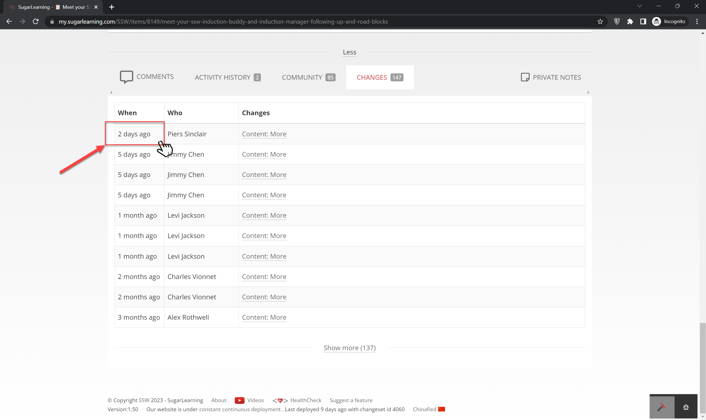
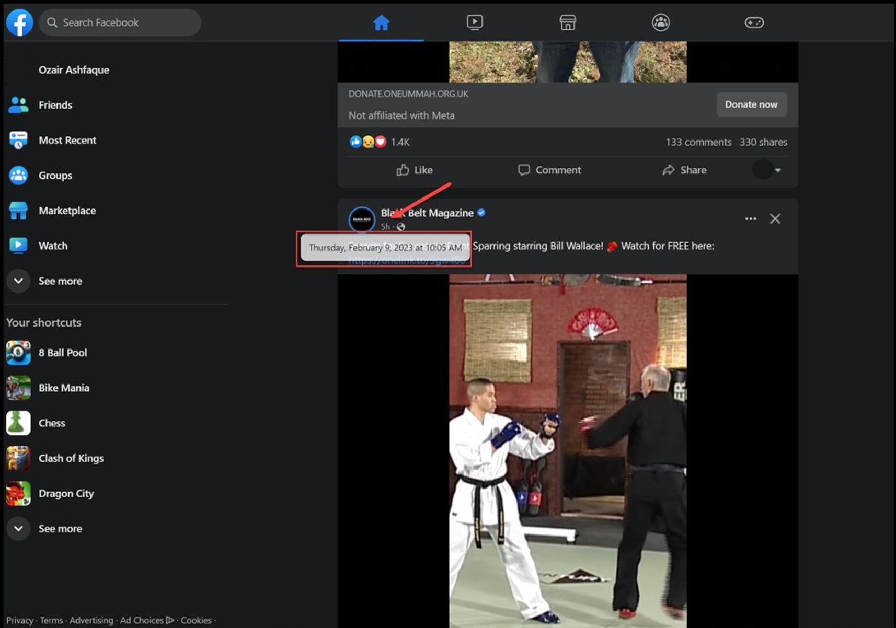
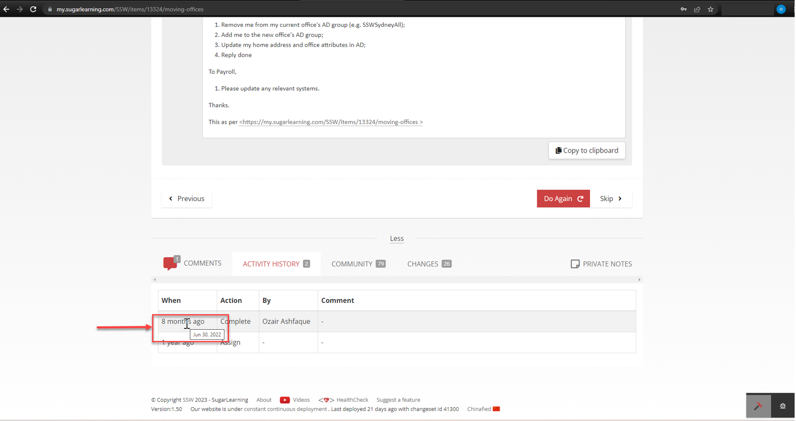

Displaying the date and time of change as a tooltip when users hover over the time of change can be an effective approach for interfaces with limited space or when providing both pieces of information together could lead to confusion.

Tooltips allow users to access additional information about the context of the date and time of change without cluttering the main interface.

<!--endintro-->

::: bad

:::

::: good

:::

::: good

:::
