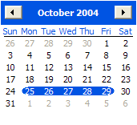
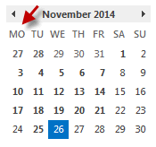

                    In Outlook, the Calendar control has a number of important features:
<ul><li>Saturday and Sunday are displayed at the <em>end</em>.</li><li>Days that have data associated with them are <strong>bold</strong></li><li>The current day is highlighted with a box</li></ul>
 <excerpt class='endintro'></excerpt> 

​

                    Users are familiar with the Outlook calendar control. When the calendar control 
                    is used it should incorporate all of these features of the Outlook calendar 
                    control.
<dl class="badImage"><dt>
                        </dt><dd>
                        Figure: Bad Example - Calendar Control - Sunday is at the front, today's date is 
                        not highlighted, and items with data are not bolded</dd></dl><dl class="goodImage"><dt>
                        </dt><dd>
                        Figure: Good Example - Calendar Control - Monday is at the front, today's date 
                        is highlighted, and items with data are bolded</dd></dl>
                
                    
                        
                            We have a program called <a href="http://www.ssw.com.au/ssw/CodeAuditor/">SSW Code Auditor</a> to 
                            check for this rule.

