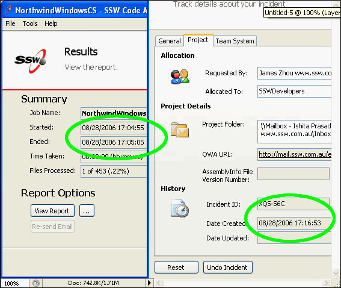

Date formats should always be kept consistent across your application, more importantly, it should be kept consistent with the operating system's regional settings otherwise this will cause significant confusion for your users.

<!--endintro-->

  

::: bad  
  
:::

::: good  
  
:::

The best way to do this in your code is to grab the culture information from the application thread and use it to automatically format your Datetime data type. Do not use hard coded datetime formatting strings unless it's absolutely necessary.

```
startTimeTextBox.Text = resultResults.StartTime.ToString("dd/MM/yyyy hh:mm:ss");
```
::: bad
Figure: Bad Example - using hard coded formatting string
:::

```
'VB.NET
'Initial CultureInfo settings for the application
Public initialCulture As CultureInfo
...
...
txtDateCreate.Text = CType(txtDateCreate.Tag, System.DateTime).ToString(initialCulture.DateTimeFormat)
```
::: good
Figure: Good Example - Using culture info to format datetime
:::
