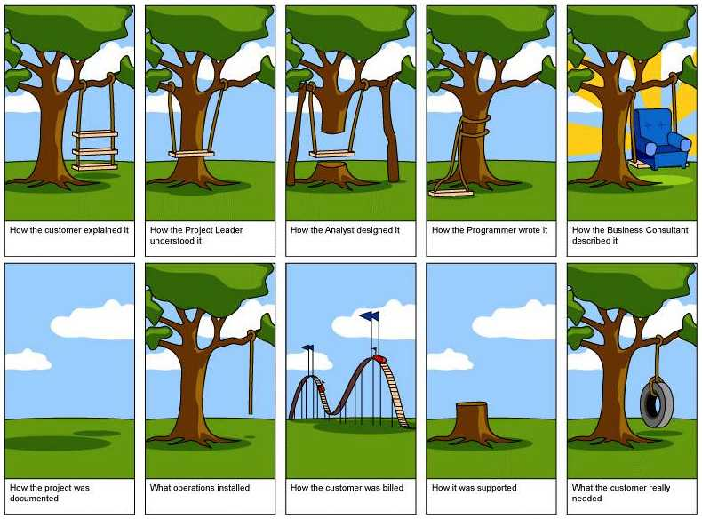

If you still need help, [visit our Scrum consulting page](https://www.ssw.com.au/ssw/Consulting/Scrum.aspx) and book in a consultant.

SSW's [Rules to Better Scrum using Azure DevOps](/rules-to-better-scrum-using-azure-devops) allows businesses to address their most important challenges first and respond quickly to change. Our rules advocate software consultants working on-site, or on the phone, so long as there is close consultation with business users, with the goal to become integrated members of the client's team.

<!--endintro-->

> Software must help a business become more efficient and build better relationships with their clients. Business need software to be produced cost-effectively and quickly. Simple steps upfront stop software being slow to build and difficult to change.
>
> * Adam Cogan, SSW Chief Architect

