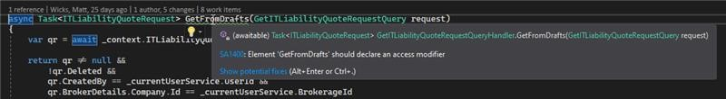

​Not explicitly specifying the access type for members of a structure or class can be misleading for other developers. The default member accessibility level for classes and structs in Visual C# .NET is always private. In Visual Basic .NET, the default for classes is private, but for structs is public.​ 

 <excerpt class='endintro'></excerpt> 

Match MatchExpression(string input, string pattern) 
<dd class="ssw15-rteElement-FigureBad">Figure: Bad - Method without member accessibility declared  </dd>
private Match MatchExpression(string input, string pattern)  
<dd class="ssw15-rteElement-FigureGood">Figure: Good - Method with member accessibility declared </dd><dl class="ssw15-rteElement-ImageArea">​<strong>Figure: Compiler warning given for not explicitly defining member access level</strong> </dl>
 

We have a program called <a href="https://www.ssw.com.au/ssw/CodeAuditor/Rules.aspx#Interoper">SSW Code Auditor </a> to check for this rule.  

