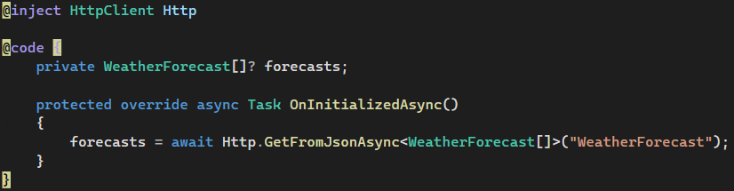
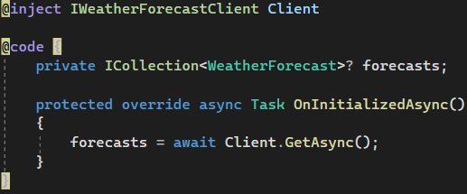

When creating Blazor components that communicate with web APIs it is often tempting to inject the `HttpClient` and use it directly to send requests. While this is quick and easy to accomplish, this tightly couples the component to the `HttpClient` and the specific implementation of the web API. The downside of this tight coupling is that the component cannot be easily refactored for breaking changes (e.g. routes, payloads, querystrings, auth, etc) then the blast radius of changes can be quite substantial. The problem grows even further if accessing the API from multiple components. Another downside is that the component is no longer unit testable. Integration tests will be necessary which will require more effort to implement.

<!--endintro-->

Following the Dependency Inversion Principle (DIP) from the SOLID principles means that we should favour coding towards an interface rather than concrete implementations.

Using an abstract client interface to interact with a web API has multiple benefits. One major benefit is that the  component is decoupled from the concrete implementation of the web API client. Decoupled Blazor components can be unit tested with a mock implementation of the web API client. The decoupled concrete implementation of the web API client can also be tested in isolation without any UI concerns, and the code is more reusable in that it could be packaged and reused in other applications without any code duplication.

::: bad  
  
:::

::: good
)  
:::

### References

* [Modern Web Dev with Blazor and .NET 6 with Jason Taylor](https://www.youtube.com/watch?v=lRYrhj9lwQk)
