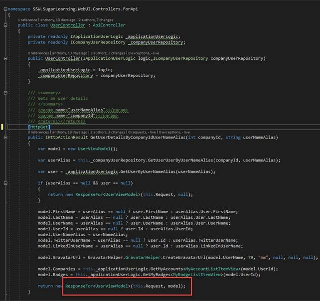

It is important to define your response types.
<dl class="badImage"><dt></dt>
dd&gt;​Figure: Bad example – no response types
</dl><dl class="goodImage"><dt></dt><dd>Figure: Good example – Response types (in .NET)</dd>
</dl>
 <excerpt class='endintro'></excerpt> 

 

/// &lt;summary&gt; /// Returns the nth number in the fibonacci sequence. /// &lt;/summary&gt; /// &lt;param name="n"&gt;The index (n) of the fibonacci sequence&lt;/param&gt; /// &lt;returns&gt;Returns the nth fibonacci number.&lt;/returns&gt; /// &lt;response code="200"&gt;int64&lt;/response&gt; [HttpGet] [ProducesResponseType(200)] [ProducesResponseType(400)] [ResponseCache(CacheProfileName = DefaultCacheProfile.Name)] [Produces("application/json", "text/json")] public ActionResult&lt;long&gt; Get(long n) { _logger.LogInformation($"Fibonacci number {n} requested"); if(!_fibonacciSolver.CanSolve(n)) return new BadRequestResult(); try { return _cache.GetOrAdd($"Fibonacci{n}", () =&gt; _fibonacciSolver.Solve(n)); } catch (ArgumentOutOfRangeException) { return new BadRequestResult(); } }
<dd class="ssw15-rteElement-FigureBad">Figure: Good example for swashbuckle - Even b​etter if you have .NET Core 2.1 use the strong typed ActionResult – see yellow​​  </dd>
        [HttpGet]         [SwaggerResponse(HttpStatusCode.OK, typeof(long))]         [SwaggerResponse(HttpStatusCode.BadRequest, typeof(void))]         public ActionResult&lt;long&gt; Get(long n)         {             _logger.LogInformation($"Fibonacci number {n} requested");                          if(!_fibonacciSolver.CanSolve(n))                 return new BadRequestResult();               try             {                 return _cache.GetOrAdd($"Fibonacci{n}", () =&gt; _fibonacciSolver.Solve(n));             }             catch (ArgumentOutOfRangeException)             {                 return new BadRequestResult();             }         }
<dd class="ssw15-rteElement-FigureGood">Figure: Good example for nswag - Even better if you have .NET Core 2.1 use the strong typed ActionResult – see yellow​​  </dd>

