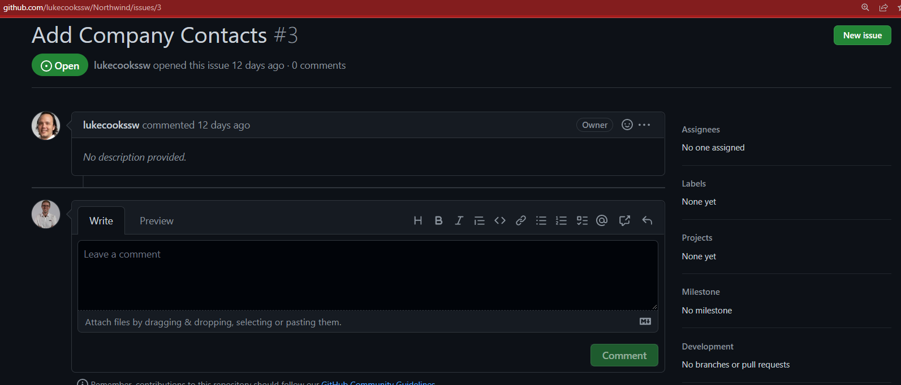
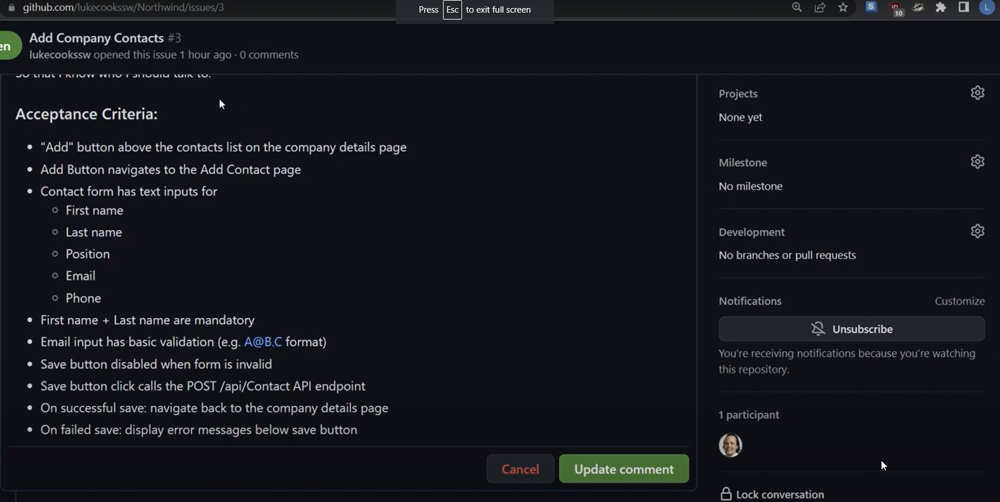

It is very common that a developer looks at a PBI to work on, only to find out that it has almost no information. When that happens, it is crucial for the developer to raise their voice and gather enough information so it meets the Definition of Ready.

<!--endintro-->

Generally, there are a few pieces of information that every PBI should have:

* Title
* [Description](/spec-do-you-use-user-stories)
  * The meat of the PBI
* [Acceptance Criteria](/acceptance-criteria)
  * Essentially the contract between the Developers and the Product Owner
* Screenshots 
  * E.g. Mock-ups, [context for bugs](/report-bugs-and-suggestions) etc
* [Estimate](/estimating-do-you-know-how-to-size-user-stories-effectively)
  * How long it's going to take
* [Business value](/do-you-estimate-business-value)
  * What's the value for the Product Owner

If the PBI is missing any of these things, make sure they are defined. Don't be afraid to push back, all developers should understand exactly what is expected.

[The Definition of Ready](/have-a-definition-of-ready) helps to enforce this, by formally documenting the requirements for acceptance from the team. So, make sure to refer to this document if there is any confusion about a PBI definition.

Here are a few key checkpoints where these issues should be flagged:

* Backlog Refinement
* Sprint Planning
* [Daily Scrums](/methodology-daily-scrums) – after in the Parking Lot 
* Before commencing work

Ideally, you want to flag the missing information early, but it is better late than never.

::: bad

:::

::: good

:::
