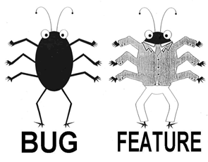
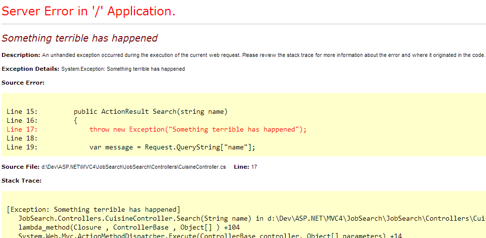
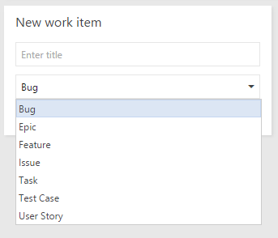
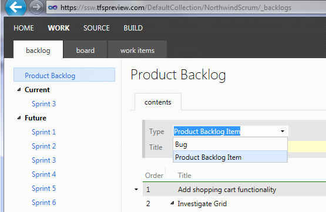

The answer to this question can make or break contracts. We think that it's such a fundamental issue it has to be captured clearly. This is how we strictly define a bug.   

<!--endintro-->

A software issue can be classed as a bug where:

1. The application **crashes to code** (excluding bugs resulting from third party products (e.g. "blue screen of death" or crashing in a third party data grid that we cannot control); **or**
2. The application displays  **data inconsistent with the specified business rules**; **or**
3. The application is  **missing functionality  specified ** in the specification; **or**
4. The  **page design/layout is substantially inconsistent** with the agreed mock-ups **and** the developers can reproduce the above on the test server **and** the application is not yet "live" **and** the issue has been reported in time (generally 30 days).

### Examples of what \*could\* constistute a bug

1. The application crashes to code because it doesn't check that a connection is valid before running a stored procedure  **(this is likely covered because it crashes to code)**
  

2. A sum total is negative instead of positive because the wrong operator (plus instead of minus) has been used to calculate the running balance  **(this is likely covered because data is inconsistent with the specified business rules)**
  

3. The application is missing the Monthly Sales report **(this is likely covered because the application is missing functionality specified in the specification)**

4. The output HTML in the application is formatted way out of line and does not display in the specified browser (e.g. Internet Explorer 9) **(this is likely covered because it substantially inconsistent with the agreed mockup)**

### Examples of what is \*not\* a bug

1. Any problem caused by software or an application not written by the organization supplying the software.
2. The customer requirement was not included in the user interface/mock-ups/specifications.
3. The client decides that they don't like the look of the current form even though it is the substantially the same as shown in the specification and wants the buttons at the bottom of the form instead of at the top.
4. The original specification states that the total price excludes GST, but it really should have included GST. This is a change to the specification, and is not included in the contract.

### Using Work Items in Azure DevOps or GitHub

Using a Work Tracking tool allows you to create work items such as user stories, bugs, tasks, test cases etc. Only create bugs for defects, faults, flaws, or imperfections that fulfill your definition of a bug. For everything else use other work item types.

### Handling additional work for fixed-price contracts

Scrum wasn't designed for fixed price, fixed scope contracts, however, any new features or modifications (non-bug items) not in the original Sprint or Sprints are classed as additional work and are outside the scope of the contract. Any tasks which **are** bugs should be marked as additional items and be completed in the current sprint if possible. Most importantly, after the sprint plan has been sent, **a PBI should NOT be entered as an item (additional or otherwise) in ANY sprints if they are not a bug**. Instead, move all non-bug items to the Product Backlog for future review after the warranty period for the fixed price contract has passed.

### Handling additional work in a Scrum project

Any new features or modifications (non-bug items) not in the original Product Backlog are classed as additional PBI's and placed on the Product Backlog. Any tasks which **are** bugs found during the current Sprint should be fixed within the current Sprint. Any tasks which  **are** bugs found outside of the current Sprint should be added to the Product Backlog. See [Do you know when to create bugs?](/during-a-sprint-do-you-know-when-to-create-bugs "Do you know when to create bugs?") and [Do you know the 3 steps to a PBI?](/do-you-know-the-3-steps-to-a-pbi)

::: info
**Note:** The above is our definition. Others have different definitions that we do **not** subscribe to: [Painless Bug Tracking](https://www.joelonsoftware.com/2000/11/08/painless-bug-tracking/).
:::

You can also use the Wiki definition of "Software Bug" as a reference to understand this concept: [Wikipedia Definition of Software Bug](https://en.wikipedia.org/wiki/Software_bug).
