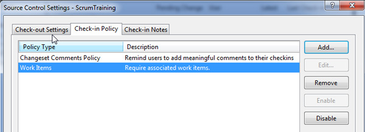

Having a clear "Definition of Done" for your team is critical to your success and quality management in Scrum.

The "Definition of Done" is a structured list of items, which exists to ensure that the team agrees about the quality of work they’re producing. It is defined by the team and serves as a checklist that is used to determine completeness.

Every team is different, but all need to agree on which items are in their "Definition of Done".  

<!--endintro-->

## There are 3 levels of 'Done' in communication

### Level 1

* [Documenting/updating the standard](/document-the-job) (for processes, when necessary)
* Sending a ["Done" email](/dones-do-you-reply-done-and-delete-the-original-email)

### Level 2

* Documenting/updating the standard (for processes, when necessary)
* Sending a "Done" email
* Screenshots
* Code

### Level 3

* Documenting/updating the standard (for processes, when necessary)
* Sending a "Done" email
* Recording a quick and dirty "[Done Video](/record-a-quick-and-dirty-done-video)"
* Code (showing a full scenario, e.g. a user story)

## There are 8 levels of 'Done' in software quality

Start with these examples showing typical "Definitions of Done" from beginner teams to more mature teams:

### Team - Level 1

* The code compiles
* All tasks are updated and closed
* No high priority defects/bugs are outstanding for that user story

### Team - Level 2

* *All of the above, plus*
* All unit tests passed
* Tests achieve greater than 1% code coverage (not earth shattering, but you need to start somewhere)

### Team - Level 3

* *All of the above, plus*
* Successful build on the Build Server
* [Git Branch Policies](/protect-your-master-branch) OR
* Azure DevOps Check-in Policy
  * Change set Comments - all check-ins must have a comment
  * Work Items - all check-ins must be associated with a work item
* Code reviewed by one other team member (e.g. Checked by Bill)
* Sending a Done email with screenshots

::: good  
  
:::

### Team - Level 4

* *All of the above, plus*
* All acceptance criteria have been met
* All acceptance criteria have an associated passing test (e.g. an Azure Test Plans test case or automated end-to-end test in Playwright)  
  **Tip:** Use Microsoft | [Azure Test Plans](https://docs.microsoft.com/en-us/azure/devops/organizations/billing/buy-access-tfs-test-hub?view=azure-devops-2020#buy-monthly-access-to-azure-test-plans)
* Sending a Done email (with video recording using SnagIt)

::: good  
  
:::

`youtube: https://www.youtube.com/embed/JJCgP7XcpNA`

::: good
Figure: Good example - Done video showing the features worked on
:::

### Team - Level 5

* *All of the above, plus*
* Deployed to UAT (ideally using Continuous Deployment)
* Complex code is documented (helping to avoid technical debt)
* Product Owner acceptance

### Team - Level 6

* *All of the above, plus*
* Application automatically tested in multiple environments, using services such as [Azure DevTest Labs](https://docs.microsoft.com/en-us/azure/devtest-labs/devtest-lab-overview) and [BrowserStack](https://www.browserstack.com/)

### Team - Level 7

* *All of the above, plus*
* Automated Load Testing (see [the best load testing tools for web applications](/the-best-load-testing-tools-for-web-applications)
* Continuous Deployment

### Team - Level 8 (Gold)

* *All of the above, plus*
* Deployed to Production

Congratulations! You are frequently deploying to production. This is called “Continuous Delivery” and allows you to gather quick feedback from your end users.

You might have everything deployed to production, but it might not yet be visible to the end user. This can be achieved by having “[Feature toggles](https://martinfowler.com/bliki/FeatureToggle.html)” in place. The actual release of the functionality is a decision that the Product Owner and business takes.
