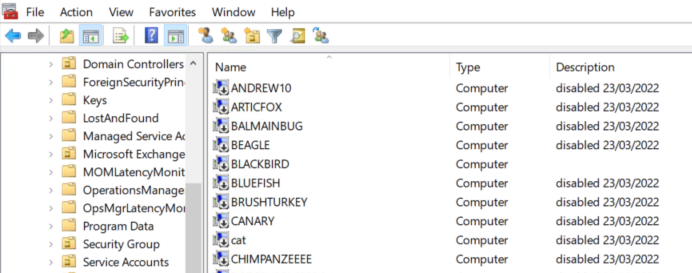
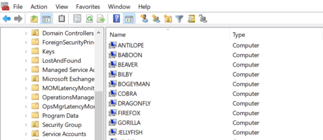

Keeping your Active Directory environment tidy is helpful to keep things running smoothly, but it is also important to improve your security posture.

<!--endintro-->

Computer accounts in AD are similar to user accounts - they can be used to access other systems and data in your domain. Since computer accounts do not hold any useful information, it is safe to delete them when a computer is decommissioned. It is also very easy to re-join a computer to the domain if needed, so there is no reason to leave computers in a "disabled" state.

:::bad

:::

:::good

:::