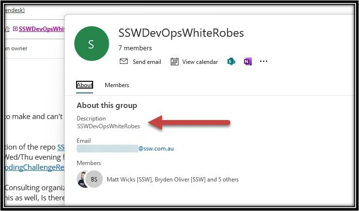
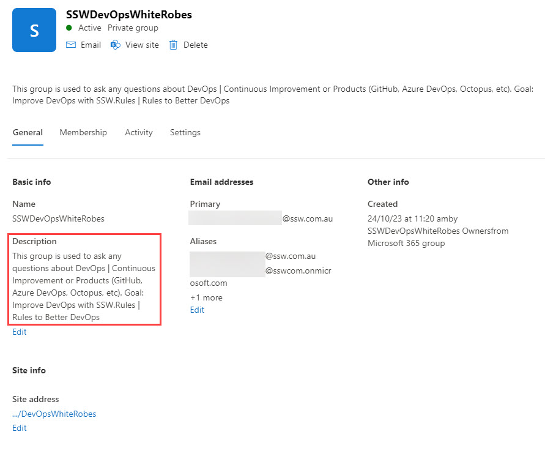
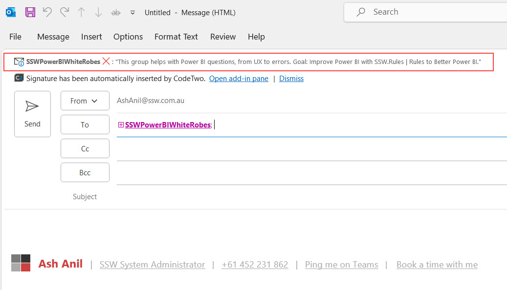

Groups without descriptions lack context, making it difficult for users to understand their purpose. 
Members may not know why they are part of the group, leading to confusion and miscommunication.  

Descriptions for Office 365 Groups and Distribution Lists (DL) play a crucial role in enhancing communication, collaboration, and management within an organization.

<!--endintro-->

A group description provides valuable information about the purpose, scope, or membership of the group. It helps users understand the group's function and decide whether to join or interact with it. It's like a group's identity card! 

::: bad

:::

::: good

:::

#### Adding MailTips for Internal Groups

A mail tip is a brief message that appears when someone adds the group to an email. It can provide additional instructions, warnings, or important information about the group. It is better to add the group description as a mail tip.\
This ensures that whenever someone adds a group to an email, they will see the description of the email as shown in the below figure.  

::: good

:::

You can use PowerShell to add the mail tip to both distribution lists and Office 365 groups.  

> NOTE: MailTip maximum length is 175 characters. 

```powershell
# Connect to Exchange Online
Connect-ExchangeOnline  

# Add Group Name
$Identity = "Distribution/office365 group name"


# Set the mail tip for the group
$Mailtip = "This group is a {{ NAME CLOSELY RELATED TO THE GROUP NAME }} group for {{ REASON FOR GROUP EXISTING }}. Goal: {{ WHAT IS THE GOAL/OBJECTIVE OF THE GROUP }}."


# Add the mail tip to the distribution list
set-distributiongroup "$Identity" -MailTip "$Mailtip"

# Add the mail tip to the Office 365 group
set-unifiedgroup "$Identity" -MailTip "$Mailtip"

# Disconnect to Exchange Online
Disconnect-ExchangeOnline
```