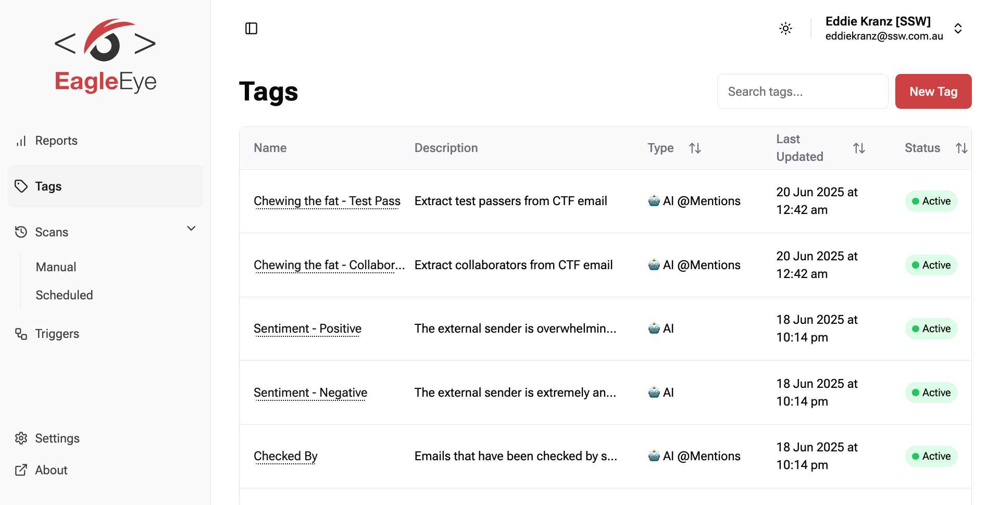

It’s tempting to fix small UI issues on the fly - change a button size, adjust some spacing, or tweak a color. But those “quick wins” often turn into long-term losses, leading to a messy, inconsistent UI that confuses users and slows development.

<!--endintro-->

Design debt is like technical debt: shortcuts that seem efficient in the moment create chaos down the line. Without a shared system, visual inconsistencies multiply, developers second-guess design intent, and user experience suffers.

## What causes design debt?

It usually starts with innocent intentions:

* "Just added a quick icon"
* "Tightened the padding a bit"
* "Didn't want to bother design - it's small"

We’ve all done it. But enough of these add up fast. Before you know it, the product starts to feel inconsistent, design is out of sync, and developers redo work they thought was already done.

## Why design debt matters

### 🚨 Why it happens

* Rushed timelines or MVP mindset ("we'll fix it later")
* No shared design system
* Designers and developers working in silos
* Unclear product direction or pivots

### 📉 Why it’s a problem

* Hurts user trust and usability
* Makes the product feel messy or inconsistent
* Slows future development and design
* Causes rework and team friction

### 🧹 How to manage it

* Run regular UX audits and design reviews
* Maintain a living design system or component library
* Include UI refactoring in your roadmap
* Document design decisions with clear rationale

## How to prevent design debt

### 1. Before you code

First check if what you want to change is already in the design system. If yes, you just need to follow it. If not, then ask yourself:

* Will users see this change?
* Does it affect layout, spacing, interaction, or visuals?

If the answer is "yes" or you're not sure; **it involves design**. So ask for a "Test Please" and tag a designer on the PBI.

### 2. Track it properly

Even small tweaks need visibility:

* Create a PBI for every UI change
* Tag it "needs-design" or "minor-UI" depending on the impact
* Let the PO and designer review and prioritize

### 3. Use the design system

Design systems are like component libraries — but for UI.

* If the component exists, use it
* If it doesn’t, ask if a new pattern is needed

Always check with design — no exceptions.

## Example –  Borders vs underlines on links

::: bad

:::

::: good

:::

## More ways to prevent design debt

* Screenshot your change and post it in the PBI before merging
* Ask for a quick "test please" from a designer 👀 on spacing, alignment, and component use
* Loop in design early on bigger stuff (e.g. layout or feature changes)
* After merge, let design know if you created something reusable

## Treat design like code

Every visual tweak changes the product - just like changing a line of code. So follow process, get the right people involved, and respect the system. 🤖
