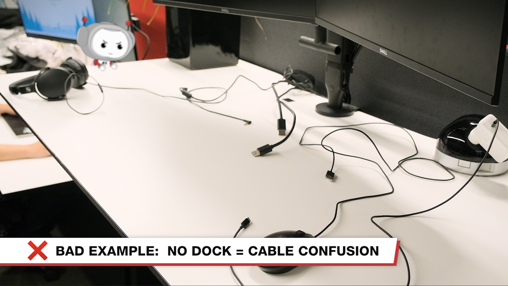

Offices can be busy environments and it important to have desks avaliable for employees to start working quickly. They shouldn't need to spend time finding cables and adapaters to connect their laptop to external displays and other peripherals.

To avoid this hassle, each desk should have a dock setup so employees can connect with a single cable.

<!-- endintro -->

::: bad

:::

::: good

:::

There are some rare scenarios where people wont use docks. This is ok, but you need to ensure the desk is setup properly for the next user.
All cables should use the dock whereever possible.

