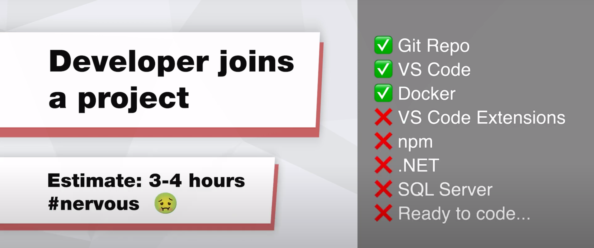

Developers love the feeling of getting a new project going for the first time. Unfortunately, the process of making things work is often a painful experience. Every developer has a different setup on their PC so it is common for a project to require slightly different steps.

The old proverb is *"Works on my machine!"*

Luckily, there is a way to make all development environments 100% consistent. 
            
<!--endintro-->

`youtube: Yhp37fPn6dQ`

**Video: Dev Containers from Microsoft (was Remote Containers) with [Piers Sinclair](https://ssw.com.au/people/piers-sinclair) (5 min)**

Dev Containers let you define all the tools needed for a project in a programmatic manner. That gives 3 key benefits:

✅ Consistent isolated environments

✅ Pre-installed tools with correct settings

✅ Quicker setup (hours becomes minutes)

### How do I set it up?

Microsoft has a great [tutorial](https://learn.microsoft.com/en-us/training/modules/use-docker-container-dev-env-vs-code/) and [documentation](https://code.visualstudio.com/docs/devcontainers/containers) on how to get it running.

### How does it work?
Dev Containers are setup with a few files in the repo:

* [devcontainer.json](https://containers.dev/implementors/json_reference/) - This specifies the setup instructions for your Dev Container e.g. post creation commands, VS Code extensions
* [Docker-compose.yml](https://docs.docker.com/compose/compose-file/#compose-file-structure-and-examples)
* [Dockerfile](https://docs.docker.com/engine/reference/builder/) 

These files define an image to use, tools to install and settings to configure.

Once those files are configured, you can simply run a command to get it running.

### Where to run it - locally or in the cloud?
There are 2 places that Dev Containers can be run:

* **Your PC** - Dev Containers in VS Code 
* **In the cloud** - [GitHub Codespaces](https://github.com/features/codespaces) 

Locally works awesome if you have a powerful PC. However, sometimes you might need to give an environment to people who don't have a powerful PC or you might want people to develop on an iPad. In that case it's time to take advantage of the cloud.

### ⚠️ Warning - Supported Tools
The following tools are not supported yet
* .NET Framework (because it is a linux container)
* [Visual Studio](https://containers.dev/supporting)

::: bad

:::

::: good

:::

If you have a reason for not doing all of this, you should at least [containerize your SQL Server environment](/containerize-sql-server).
