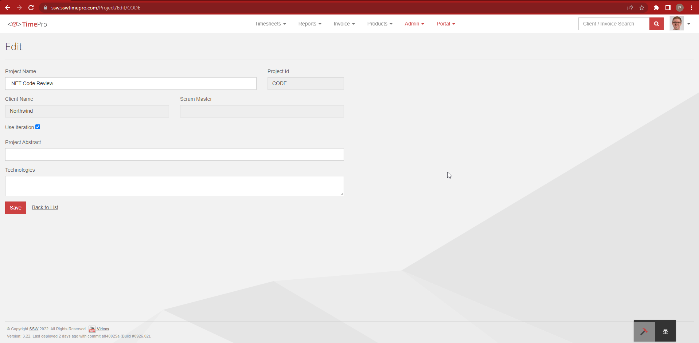
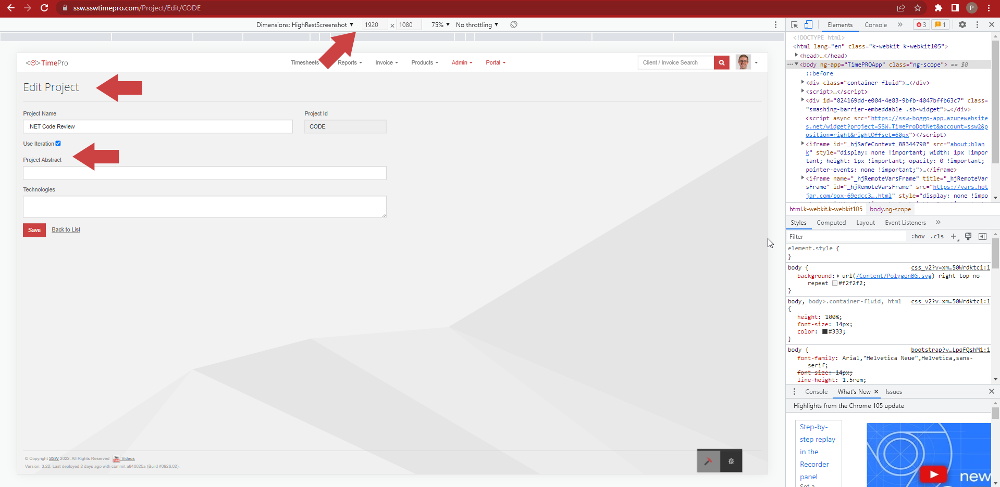

Sometimes you need to capture high-resolution screenshots and create UI mock-ups. In such situations, there is an impressive trick that allows for capturing screenshots with extremely high resolution while easily editing elements on the screen

<!--endintro-->

The idea is to utilize the developer console tool to edit HTML and make changes to elements on a webpage, such as hiding a div or modifying text within a heading. They rely on the inspect menu option to locate the specific element they wish to modify.

Furthermore, they have found that zooming in on the screen provides a better view when capturing screenshots. This enables them to capture finer details and enhance the overall quality of the screenshot.

These tricks have proven to be valuable tools in their video production process, enabling them to produce high-quality visuals and make necessary adjustments to the user interface.

­­

