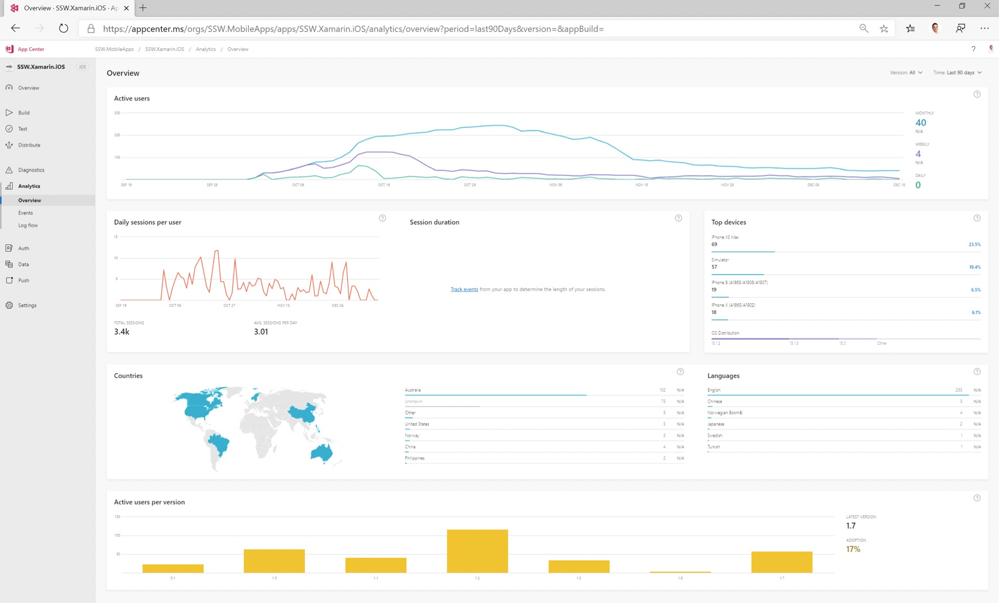

Now that your team is spending less time deploying the application, you’ve got more time to improve other aspects of the application, but first you need to know what to improve.

Here are a few easy things to gather metrics on:

<!--endintro-->

### Application Logging (Exceptions)

See how many errors are being produced, aim to reduce this as the produce matures

* [https://rules.ssw.com.au/do-you-use-the-best-exception-handling-library](/_layouts/15/FIXUPREDIRECT.ASPX?WebId=3dfc0e07-e23a-4cbb-aac2-e778b71166a2&TermSetId=07da3ddf-0924-4cd2-a6d4-a4809ae20160&TermId=8c5a1235-d169-4164-92a1-08812c26fc22)
* Application Insights
* RayGun.io
* [Visual Studio App Center](https://appcenter.ms/)(for mobile)

But it's not only exceptions you should be looking at but also how your users are using the application, so you can see where you should invest your time

* Application Insights - https://rules.ssw.com.au/why-you-want-to-use-application-insights
* Google Analytics
* RayGun.io (Pulse)

### Application Metrics

Application/Server performance – track how your code is running in production, that way you can tell if you need to provision more servers or increase hardware specs to keep up with demand

** 

** <dd class="ssw15-rteElement-FigureNormal">Figure: App Center can let you monitor app install stats, usage and errors from phones just like an app running in Azure </dd>

Process Metrics

Collecting stats about the application isn't enough, you also need to be able to measure the time spent in the processes used to develop and maintain the application. You should keep an eye on and measure:

* Sprint Velocity
* Time spent in testing
* Time spent deploying
* Time spent getting a new developer up to speed
* Time spent in Scrum ceremonies
* Time taken for a bug to be fixed and deployed to production

### Code Metrics 

The last set of metrics you should be looking at revolves around the code and how maintainable it is. You can use tools like:

* Code Analysis
* [SonarQube](https://www.sonarqube.org/)
