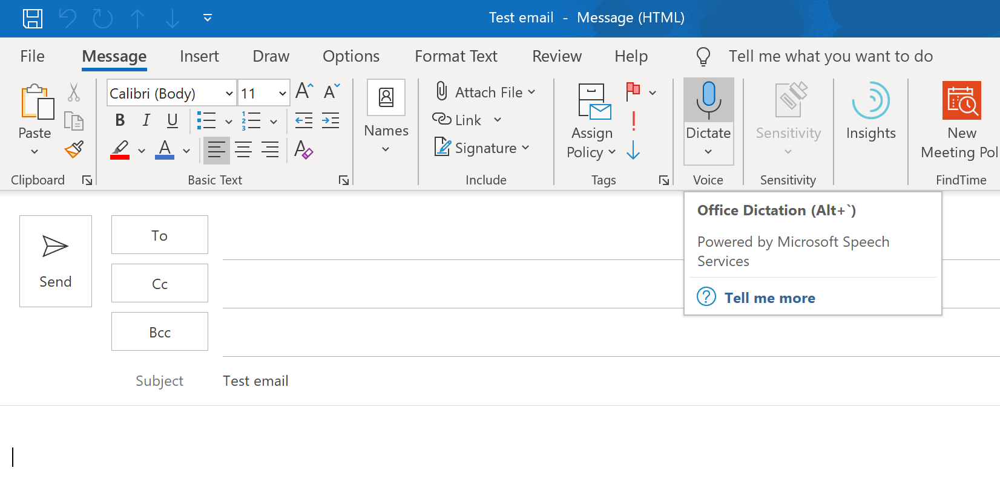

You can easily write content using your voice with the Dictate feature. It is available on Outlook, Word and PowerPoint.

<!--endintro-->

See how it works including some tips on this video by Ulysses Maclaren and Adam Cogan:

`youtube: https://www.youtube.com/embed/1Jx-8d4DnVs`