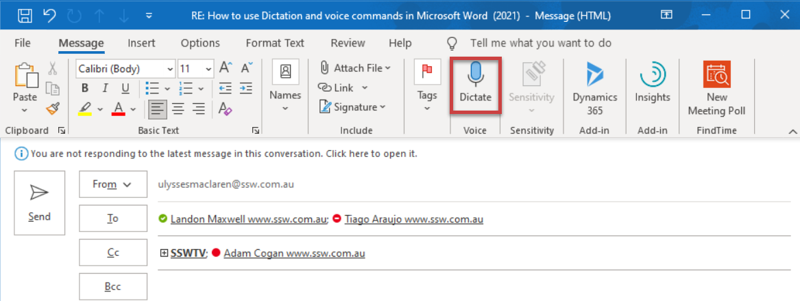
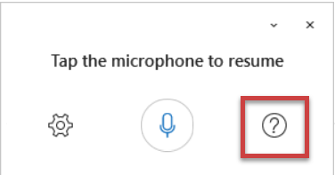

Everyone knows that you can use Google Assistant or Siri to talk to your phone, but not everyone knows that you can also use dictate in Microsoft Word, PowerPoint and Outlook.

<!--endintro-->

You can choose whether you want automatic punctuation or not, and it's quite good at figuring out what the correct punctuation should be, most of the time.

Key commands that you will likely need include:

* New/next paragraph
* Backspace
* Delete/scrap/undo (removes last word)
* Delete/scrap/undo that (removes last sentence)
* Delete/scrap/undo the last x characters/words/lines/sentences
* Start list
* Start numbered list
* New/next line
* Exit list
* Bold/italicise/underline <word or phrase you want formatted>
* Exit dictation

`youtube: https://www.youtube.com/embed/7-soraKpUcY`

### Hot Tip - Windows Dictation

If you really get into using dictation, you can press windows key + H to dictate directly through the operating system. This is particularly useful if, for instance, you want to dictate a message in Teams, or something else that doesn't have its own dictation function built in.
