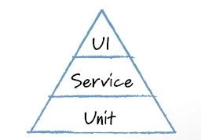

\***\*Replace this with a specific rule on the test pyramid?**

Having an awareness of the different types and levels of testing is critical to developing appropriate test strategies for your applications. Remember that different types and levels of tests help to mitigate different types of risk in your software.

There are various models to help with this, stemming from Mike Cohn's simple [automated testing pyramid](https://www.mountaingoatsoftware.com/blog/the-forgotten-layer-of-the-test-automation-pyramid) in 2009:

**reuse image**

<!--endintro-->

pyramids, bug filter idea (Sussman), etc. 

**Add your rule to a category**