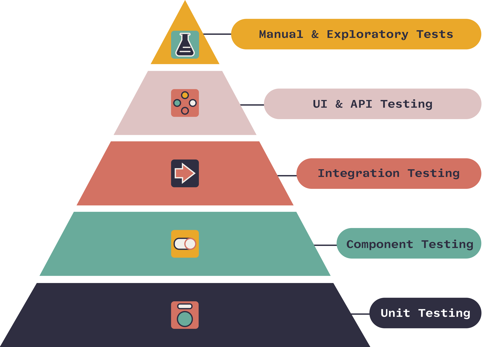
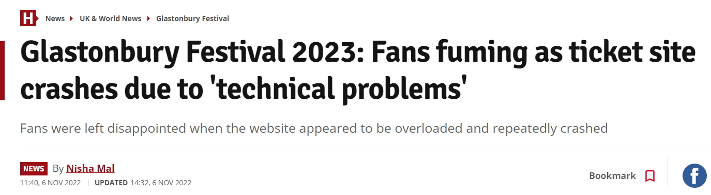

There are a lot of different ways to test software. Developers will often write unit or integration tests for their code, but can sometimes fall into the trap of trying to test all things the same way (aka the "golden hammer"). 

How much does it cost to fix a bug? It depends when it is discovered. If the dev notices it 1 hour after writing it, then it is cheap to fix. If the bug is discovered after it is live and lots of people are using it, then it is much more expensive to fix. If it is discovered after the developer has left the company, then it is super expensive to fix.

<!--endintro-->

A good test strategy employs a combination of different types of testing, performed using an appropriate mix of human testing and automation. Each type of testing is designed to help mitigate different types of risk.

## Goals of Testing
The testing pyramid shows the *types* of tests you will typically use in the Software Development Lifecycle, but it's important to understand how **testing types** differ from **testing goals**.

The goal of any test is to identify and mitigate risk.

Different testing types are better suited to different testing goals. For instance, if your goal is to test whether a **method** you wrote achieves what you intended, the best type of test will probably be a **unit test**. Alternatively, if your goal is to test that 2 or more **applications** or **services** play well with one another, then an **integration test** would be more appropriate.

What if the goal is to test an entire **user journey**, to ensure a user can add an item to their shopping cart and complete the checkout process to make a purchase? **End-to-end tests!**

::: greybox
**Note**: None of these test types, or test goals, have been described as manual or automated. This distinction describes the "how" of the test. *How* should you perform an end-to-end test of your purchasing journey? That's a business decision, and you should check out our rule on [deciding whether a test is a good candidate for automation](/good-candidate-for-automation/).
:::

`youtube: https://www.youtube.com/embed/YaXJeUkBe4Y`
**Video: 5 Types of Testing Software Every Developer Needs to Know! (6 min)**

The following list of testing types and their goals is not exhaustive, but covers the more common scenarios you should consider when building a comprehensive test strategy:

| Testing type | The goal of mitigating risk around...  |
| :------------- | :--------------------------------------------- |
| [Smoke testing](#1-smoke-testing) | Basic and critical functionality failing to work as expected  |
| [Unit testing](#2-unit-testing) | Code changes |
| [Integration testing](#3-integration-testing) | Problems introduced by different modules or services interacting with each other |
| [Consumer-driven contract testing](#4-consumer-driven-contract-testing) | Changes to a service impacting the consumers of that service |
| [Regression testing](#5-regression-testing)  | Intentional code changes causing unintended effects |     
| [End-to-end testing](#6-end-to-end-testing) | Real users' journeys through the software becoming broken |
| [Acceptance testing](#7-acceptance-testing)  | Failing to meet the business/user requirements |
| [Performance testing](#8-performance-testing)   | Surprises when the software is under load |

::: info
Don't confuse test approaches & techniques (focused on the "how") with types of testing (the "what"). For example, [exploratory testing](/what-is-exploratory-testing) - as an approach - applies well to several of the types of testing outlined above.
:::

### 1. Smoke testing

Smoke testing is designed to verify that the critical functionality of the software is working, at a very high level. The software is put under limited pressure (undergoing only shallow testing) to make sure no smoke comes out.

The smoke test is meant to be quick to execute, with the goal of giving you some assurance that the major features of your system are working as expected. 

Smoke tests can be useful right after a new build is made to decide whether or not you can run deeper (and more expensive) tests, or right after a deployment to make sure that they application is running properly in the newly deployed environment.

::: greybox
Why perform smoke testing? To mitigate the risk of the basic and critical functionality failing to work as expected.
:::

### 2. Unit testing

Unit testing is designed to help mitigate the risk of code changes. Unit tests are designed to be small in scope and they typically consist of testing individual methods and functions of the classes, components or modules used by your software. 

Unit tests are generally quick to run and are executed in an automated manner as part of a CI pipeline.

Unit tests are usually written by developers and external dependencies are mocked so that the tests only test the method or function of interest and not anything the method or function might depend on.

::: greybox
Why perform unit testing? To mitigate the risk of code changes.
:::

See [Rules to Better Unit Tests](/rules-to-better-unit-tests)

### 3. Integration testing

Integration tests verify that different modules, components or services used by your application work well together. For example, this could be testing interaction with a database or making sure that microservices work together as expected. 

For modern applications, integration tests are often implemented using the application's various APIs.

These types of tests are more expensive to run (as they require multiple parts of the application to be up and running) and are typically automated.

::: greybox
Why perform integration testing? To mitigate the risk of problems introduced by different modules or services interacting with each other.
:::

### 4. Consumer-driven contract testing

Although it falls into the category of integration testing, it's worth calling out consumer-driven contract testing as a separate testing type because it is an excellent way to implement integration testing in microservices-based architectures.

Consumer-driven contract testing is a way of integration testing a service's API prior to deploying it to a microservices-based system. Consumers define their expectations of providers in contracts, which the provider service is then responsible for meeting whenever it makes changes. In this way, a provider service can continue to change, safe in the knowledge that its consumers will not be negatively impacted by their changes. This makes consumer-driven contract testing especially useful when the system under test comprises a lot of independently developed & deployed microservices - and this type of system is essentially impossible to test using more traditional integration testing.

::: greybox
Why perform consumer-driven contract testing? To mitigate the risk that changes to a service impact the consumers of that service.
:::

### 5. Regression testing

Regression testing is designed to look at unchanged features of the application to make sure that the addition, deletion or updating of features and any bug fixes have not adversely impacted the existing features.

This type of testing is often performed before a deployment or release of the software and can be time-consuming and expensive. Making risk-based selections of which tests to perform and the judicious use of automation can both reduce the time required for regression testing.

::: greybox
Why perform regression testing? To mitigate the risk of intentional code changes causing unintended effects.
:::

### 6. End-to-end testing

End-to-end testing is designed to replicate user behaviours with the software in a complete application environment. It is a type of system testing that follows a user's (or data's) journey through the system.

While end-to-end tests can be very useful, they're expensive to perform and can be hard to maintain when they're automated. It is recommended to have a few key end-to-end tests and rely more on lower level types of testing (unit and integration tests) to be able to quickly identify breaking changes.

::: greybox
Why perform end-to-end testing? To mitigate the risk of breaking real user's journeys through the software.
:::

### 7. Acceptance testing

Acceptance testing is designed to verify that the software meets the business requirements. This type of testing requires the entire application to be running while testing and focuses on replicating user behaviours.

A special case is User Acceptance Testing (UAT) in which the software is delivered to the end-users for them to test to make sure it meets their requirements.

::: greybox
Why perform acceptance testing? To mitigate the risk of failing to meet the business/user requirements.
:::

### 8. Performance testing 

Performance testing is designed to evaluate how a system performs under a particular workload. These tests help to measure the reliability, speed, scalability and responsiveness of an application. For example, a performance test can observe response times when executing a high number of requests or determine how a system behaves with a significant amount of data. It can determine if an application meets performance requirements, locate bottlenecks, measure stability during peak traffic, etc. 

Within performance testing, **load testing** helps you to understand how the system behaves under an expected load, while **stress testing** helps you to  understand the upper limits of the system's capacity using a load beyond the expected maximum.

::: greybox
Why bother with performance testing? To mitigate the risk of surprises when the software is under load.
:::
