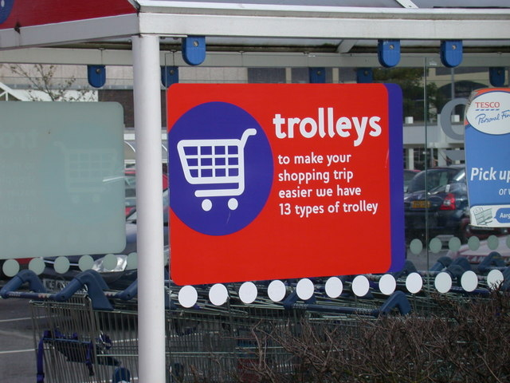

There are many different types of testing, each designed to help mitigate different types of risk.

A good test strategy employs a combination of different types of testing, performed using an appropriate mix of human testing and automation.

<!--endintro-->

The following list of types of testing is not exhaustive, but covers the more common types you should consider when building a comprehensive test strategy.

explain why we don't say functional and non-functional

### Smoke testing

Original: You fire up your application and click around prior to giving it to a tester. Most developers do this.

Atlassian: Smoke tests are basic tests that check the basic functionality of an application. They are meant to be quick to execute, and their goal is to give you the assurance that the major features of your system are working as expected.

Smoke tests can be useful right after a new build is made to decide whether or not you can run more expensive tests, or right after a deployment to make sure that they application is running properly in the newly deployed environment.

Other: One of the most essential types of functional testing must be performed first on each release. A new version must undergo smoke testing at first, and only then does the QA further test its functionality. To avoid such exhausting testing, the developer should choose only the major features to test. The goal is to examine the high-priority features of the software and to do so as soon as possible.

If a version fails the smoke test, it will be immediately sent to the developer for correction. All successful releases are called stable releases and are eligible for regression testing depending on the situation.

For example, a web application for an insurance company adds a claims status page. The testers would apply smoke tests to verify that the existing version is working at a fundamental level, such as whether a user can successfully log in, access the claims status page, and retrieve the status of a specific claim without the app not hangs or malfunctions.

Other: Smoke testing is performed to verify that basic and critical functionality of the system under test is working fine at a very high level.

Whenever a new build is provided by the development team, then the Software Testing team validates the build and ensures that no major issue exists. The testing team will ensure that the build is stable, and a detailed level of testing will be carried out further.

For example, tester is testing pet insurance website. Buying an insurance policy, adding another pet, providing quotes are all basic and critical functionality of the application. Smoke testing for this website verifies that all these functionalities are working fine before doing any in-depth testing.

### Unit testing
(+ related)

### Component testing

### Integration testing
inc. API

### Consumer-driven contract testing
type of int, why call out separately?

Regression

System

UAT

End-to-end?

Acceptance

Performance/load/stress

Atlassian: unit, integration, functional, end-to-end, acceptance, performance, smoke

::: greybox
Don't confuse test approaches & techniques (focused on the "how") with types of testing (the "what"). For example, [exploratory testing](https://www.ssw.com.au/rules/what-is-exploratory-testing) - as an approach - applies well to several of the types of testing outlined above.
:::

**Add your rule to a category**