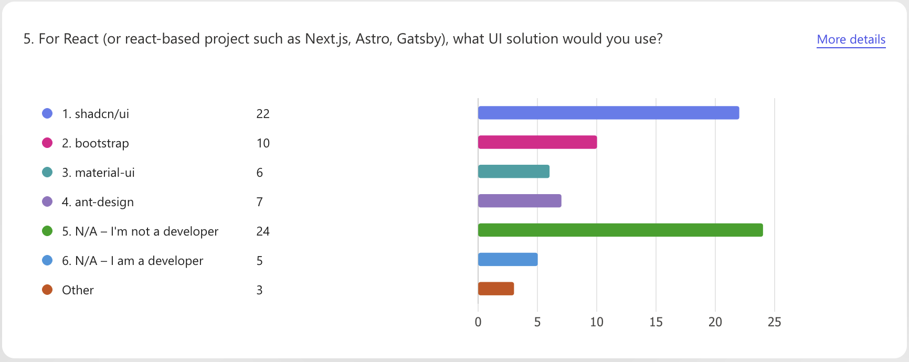
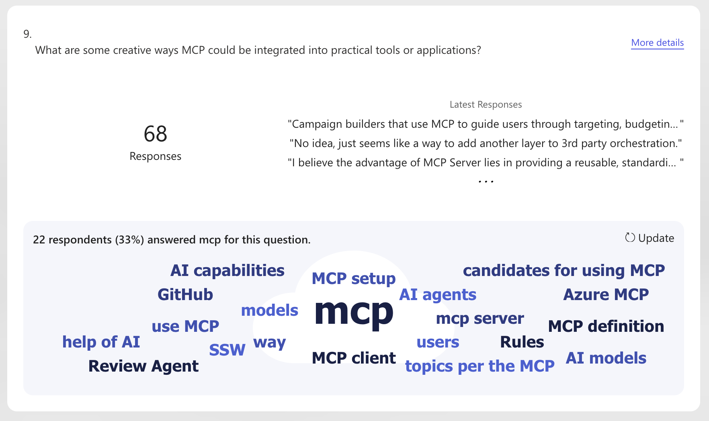
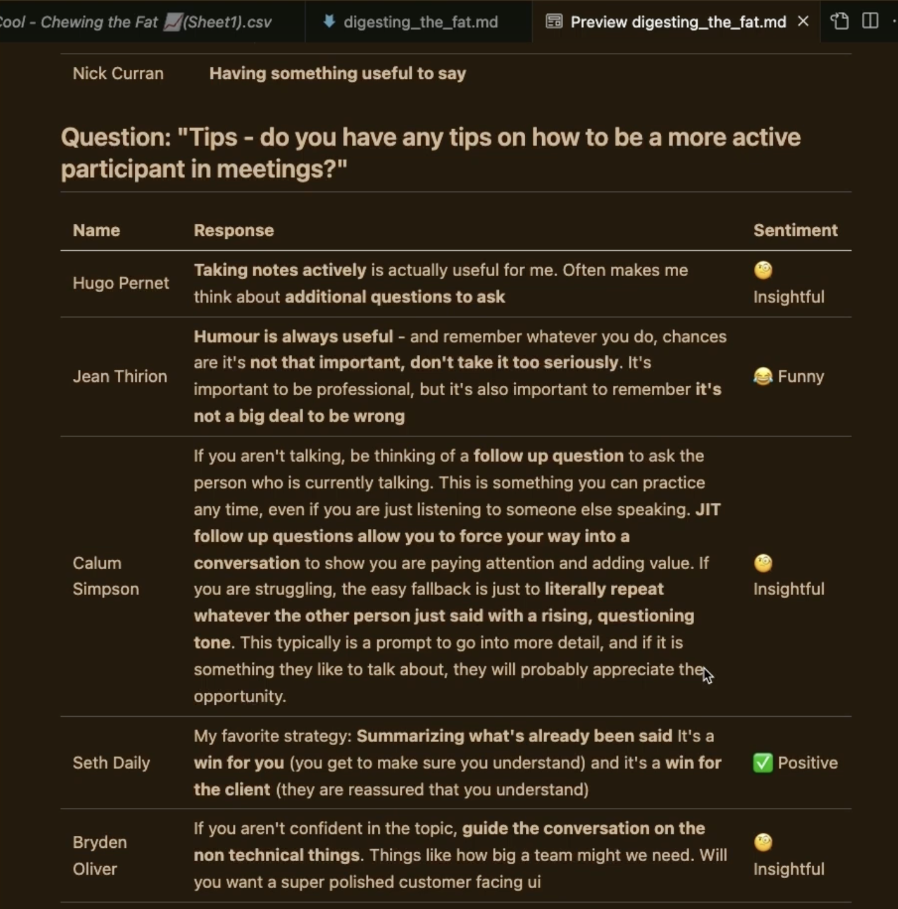

Microsoft Forms is a popular survey tool used by many organizations. When forms receive numerous responses, digesting the results becomes challenging.
            
<!--endintro-->

Microsoft Forms offers several ways to analyze your survey responses:

## Structured answers

Structured (quantitative) answers include multiple choice, range, or numerical responses. Microsoft Forms excels at automatically generating graphs for these types of answers.

::: good

:::

## Unstructured answers

Unstructured (qualitative) answers are text-based responses that allow respondents to express themselves fully, yielding more insightful survey results.

The challenge is that Microsoft Forms handles unstructured answers poorly. Your viewing options are limited to a 'word cloud' (more gimmick than analysis tool) or a basic table that contains all feedback but makes finding meaningful insights difficult.

::: bad

:::

This is where AI becomes invaluable for digesting unstructured data.

### Which AI solution works best?
Pasting responses into ChatGPT works for small surveys (up to 20 answers), but with larger datasets, it often misses important insights due to context window limitations.


We solve this using Agentic AI with chain-of-thought reasoning. The Cursor IDE provides an accessible way to apply AI to unstructured data (or Windsurf! [See our comparison table](/best-ai-powered-ide)).


Cursor Agent processes CSV data line-by-line without requiring code. This approach solves the context window problem by ensuring all answers are read and annotated, producing an enhanced version of your data with key insights highlighted.


Better yet, Cursor Agent lets you interact with your data through conversation. You can ask questions like "which responses favored x?" or "are there any highly critical responses?" You can even add a sentiment column to your output, making data analysis significantly more efficient.

### How to digest unstructured survey results with Cursor IDE 

See how to get the most out of your Microsoft Forms results with AI.

::: good

:::

::: info
[Cursor Pro](https://www.cursor.com/pricing) is required for this.
:::

1. Export your Microsoft Forms results in `.csv` format
2. Create a new folder containing the `.csv` file you would like to digest
3. Open this new folder in Cursor IDE
4. With the `.csv` open, hit `ctrl+L` (`⌘+L` for Mac users). This opens the AI panel
5. Set your model, we like `gemini-2.5-pro` with **Thinking enabled**, as it has a massive context window, and is highly ranked for text. If there are better models at the time of reading this, use them! (see the 'Text' leaderboard on [LLMArena](https://lmarena.ai/leaderboard))
5. Start prompting your .csv file! 

For example, the below prompt will read through your `.csv` line by line, highlight interesting parts of each answer, and generate a sentiment for the answer, allowing you much better 'at-a-glance' survey results. We use it to create a visual stimulus for when we record our [Digesting the Fat videos](https://www.youtube.com/watch?v=4DKH5IDp7Wk)

::: info
We like using XML tags in our prompts. They allow LLMs to parse information more accurately, leading to higher-quality outputs. See the rule: [Do you use XML to structure your AI prompts?](/ai-prompt-xml)
:::

```xml
<context>
    You're a professional CSV file interpreter. 

    Take this CSV file. It contains responses to a weekly employee survey called "Chewing the Fat".  

    You are to compile a digest of these responses, called "Digesting the Fat". 

    The end goal of "Digesting the Fat" is to create a video, so the digest should be in a format that presenters can read from quickly. 
</context>

<REMEMBER>
    Steps - COMPLETE EACH STEP BEFORE MOVING TO THE NEXT. 

    REMEMBER TO INCLUDE THE NAME OF WHO SAID EACH QUOTE WHEN TEXT IS QUOTED. Names can be found in the same row of where the quote is taken from in the CSV. 

    If you are provided multiple CSV files, you should go through each of these steps for each CSV file, and add a subheading to the markdown document for each CSV file. 
</REMEMBER>

<steps>
    <step-2>
        Collate ALL of the text-based responses into a table for each question that has a text response. All responses should be in this markdown file. 
    </step-2>
    <step-3>
        Ensure that all of the text responses have been collected into a newly created markdown file. 
    </step-3>
    <step-4>
        Once all the responses have been collected, add a new column named "Sentiment" to each of the tables in the markdown file.  
    </step-4>
    <step-5>
        For each response in the markdown file, read it, and determine the sentiment as either (✅ Positive, ❌ Negative, 🧐 Insightful, ⚠️ Critical, 😂 Funny)  
    </step-5>
    <step-6>
        Now, carefully read through each response in the markdown file. We are making a video with the results from this, and want to read any interesting parts of responses -- highlight in BOLD any interesting key words and phrases. Prioritise statements that seem original, critical, funny. Ignore generic phrases. 
    </step-6>

</steps>

<finally>
    Ensure no responses have been missed, ensure you have followed each step before moving on to the next step.
</finally>
```
::: good
Code: Good example - Cursor Prompt for generating Microsoft Forms digests from `.csv`
:::

Let us know in the comments how you've used the Cursor IDE for tasks like this. We think it's a game changer.
