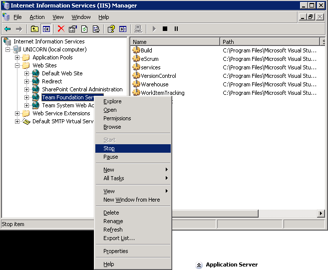

Once you are ready to start you need to make sure that no one can access the existing TFS 2008 server while you do the migration.

<!--endintro-->

1. You are ready to start
2. Send out an email notifying all users that TFS2008 will be turned off. 
  Follow [Do you have a server reboot/restart policy?](https://www.ssw.com.au/rules/have-a-server-reboot-restart-policy)
3. Make sure no-one can check in files by either:
    A. Running [TFSQuiesce](https://social.msdn.microsoft.com/Forums/vstudio/en-US/1ec7dc4a-ba2b-4d06-86a3-0924cbe3e919/tfsservicecontrol-quiesce-requirement-for-backups?forum=tfsadmin) (recommended) 
    
    B. Turning off TFS Service
        1. Remote desktop into TFS 2008
        2. Start IIS
        3. Right click Team Foundation Server | Stop

4. Confirm you can no longer get latest on the team project

