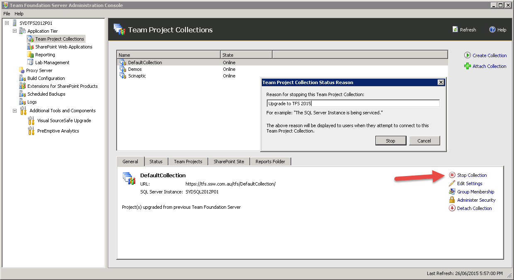
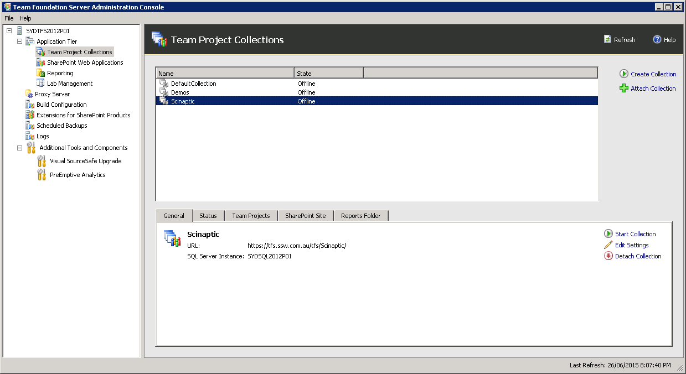
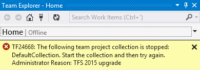

It is important that while you're upgrading, nobody can check in. Any check-ins after you backup your database will be lost.

To make sure that nobody can change anything during the upgrade, follow these steps.

<!--endintro-->

a. Send out an email notifying everyone TFS will be unavailable for the upgrade period

b. Make sure nobody can check in files:

c. Open the TFS Administration Console on the server.

d. Navigate to Application Tier / Team Project Collections.

e. For each Team Project Collection, select it, and click "Stop Collection". Enter a useful message (this will be displayed to users trying to connect from Visual Studio) and click "Stop":

f. In Visual Studio, confirm you can no longer connect to TFS

