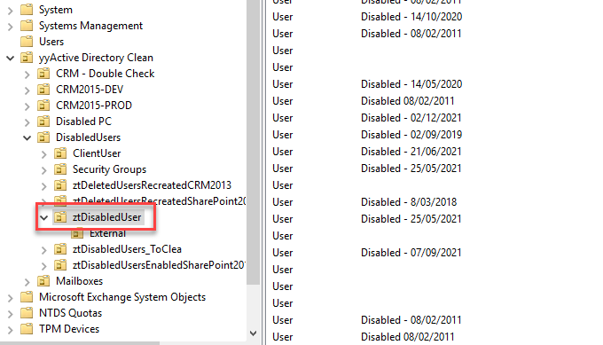

It is important to know what to do with your employees' accounts in when they leave. Getting this wrong can create security vulnerabilities - or it can make life difficult for every one if the employee comes back to work for you again. 

<!--endintro-->

You should create a list of instructions that are followed whenever an employee leaves, so that the experience is consistent for all and to make sure you don't miss any steps. Here are some important ones - you will need to add more to suit your environment.

1. Backup data. Make sure you have a backup of the employee's work. This might include:

* Outlook PST file
* OneDrive, Google Drive, etc.
* Files from their computer

2. Remove their AD user account from any group membership
3. Disable their AD account - and any other accounts they have:

* Move their account to a "disabled users" OU
* Don't delete their account, this can cause issues in the future!

4. Forward their emails to another employee
5. Make sure they return any IT equipment they have, and delete their computer account/s from AD
6. Remove any security/automation access.