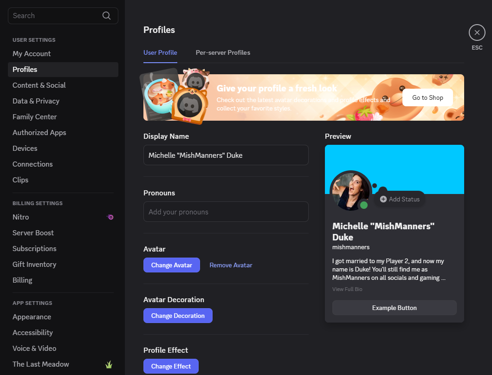
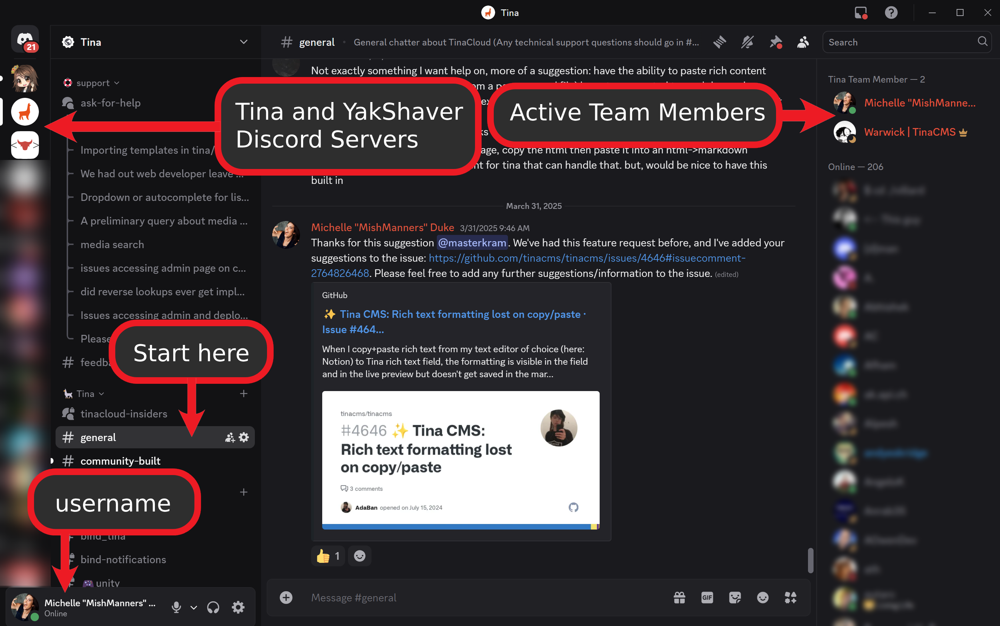

The tech community thrives on collaboration, communication, and shared learning. Discord has become one of the top platforms for developers, engineers, and open source contributors to connect. Whether you're working in support, marketing, or engineering, joining a tech-focused Discord server can help you stay informed and involved. Check out the [blog post on ten of the top community Discord servers to join](https://dev.to/mishmanners/best-community-tech-discord-servers-to-join-4gie) and find your next favorite server.

## Why Use Discord for Tech Community Engagement?

Discord is home to thousands of global tech communities. By joining public servers and engaging in open conversations—especially in public channels or GitHub Discussions—you help foster a collaborative environment where everyone can learn and contribute.

### Benefits

* Shared knowledge and transparency
* Centralized communication for features, bugs, and issues
* Encouragement of community participation in open source projects
* Easier onboarding and support for new users

Many projects now link GitHub Discussions directly to their Discord channels, making both platforms equally valuable for community interaction.

Here's how you can join Discord:

1. Head to the [Discord website](https://discord.com/), and either download Discord for PC or open in Browser

2. Either sign in or register for a Discord account. If you already have a personal account, and want another account for work, sign up for a new account

3. If you're setting up an account for the first time, set your display name, profile picture, pronouns, avatar, and any other personal preferences. You can do this via Discord | User settings | My Account | Edit User Profile:

4. (optional) Install Discord on your phone via the [App Store](https://apps.apple.com/us/app/discord-talk-play-hang-out/id985746746) or [Google Play](https://play.google.com/store/apps/details?id=com.discord&hl=en_US)

5. Find your community and join a few servers. Look for Discord invite links on websites, GitHub repos, newsletters, or social media. You will need an invite link to join a server. Some servers will allow a friend to send you an invite, and others you will need an invite directly from the server owner

::: good example :::

As an example, we have Discord servers for [Tina](https://discord.com/invite/zumN63Ybpf) and [YakShaver](https://discord.gg/Jp9dyxKFjR). If you were to join these servers you'll see them  listed under your servers:

:::

6. If you're joining a Discord server for the first time, don't forget to read the rules and announcements before posting in the server. Many Discord communities—like open source communities—have their own rules and guidelines. Just like many open source projects have contribution guidelines, you'll be expected to read the Discord rules and announcements before posting. Failure to do so, could get you banned from a community. Be sure to check channels like #rules, #announcements, or #read-this-first

7. Head to a welcome channel, such as #general, #discussions, or #introductions to say hi and share a bit about yourself

## Tips for Engaging on Discord in Tech Communities

By opening conversation in public channels, such as Discord and/or public GitHub Issues, rather than internally opening issues/PBIs, means everyone in the community can benefit and learn together. This also creates a central location for issues/features/bugs, and encourages members of the community to be involved. This is super important for open source projects.

Alternatively, many projects and services link their GitHub Discussions to a channel in their Discords server, and thus posting on GitHub Discussions is equally valued.

If you're working on a project, particularly in support, engineering, or marketing, check to see if your project has a Discord server and join it to help answer questions from the community and engage. If you're using a product or service that you enjoy, check to see if that community has a Discord server and join it.

* Use public threads and channels instead of private messages for transparency
* Stay respectful and always follow the community’s code of conduct
* Offer help when you can. By sharing your knowledge, you'll boosts your own learning and helps others
