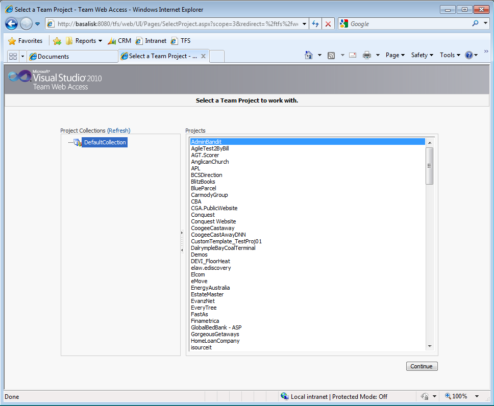

All of the hard work has been done, now you need to do a quick test.

<!--endintro-->

1. Open http://tfs.northwind.com:8080/tfs/web/
2. Confirm the Team Web Access page load and shows all your team projects
3. Make sure you can access TSWA after the upgrade
 
