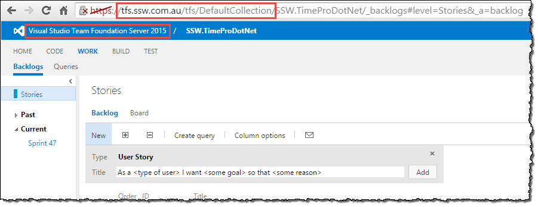

After upgrading TFS, you should do a quick [smoke test](http://en.wikipedia.org/wiki/Smoke_testing) to ensure TFS is running as expected.

<!--endintro-->

1. Navigate to the web access URL for your new TFS server.
2. If it loads correctly, click "Browse all..." to check all your Team Projects were migrated across correctly

In Visual Studio, connect to TFS, then:

3. Do a Get Latest on a project or file
4. Make a change, and ensure you can Check In
