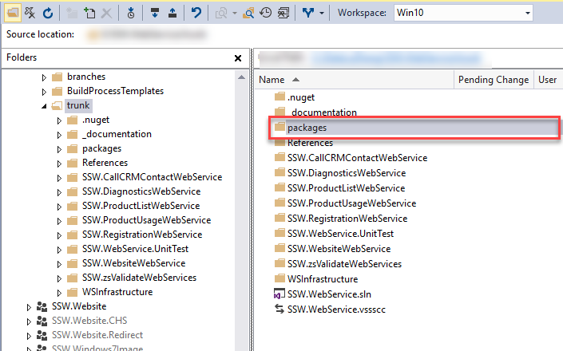

​Reasons for avoiding checking Nuget or Npm packages 
<ol><li>Distributed version control systems, such as Git, include full copies of every version of every file within the repository. Binary files that are frequently updated lead to significant bloat and lengthens the time it takes to clone the repository.</li><li>When packages are included in the repository, developers are liable to add references directly to package contents on disk rather than referencing packages through NuGet, which can lead to hard-coded path names in the project. </li></ol>

 <excerpt class='endintro'></excerpt> 

  
<dd class="ssw15-rteElement-FigureBad">Figure:  Do not have a folder called "packages" or "Node_Modules" ​ </dd>
 

Read more about how to ​<a href="https://docs.microsoft.com/en-us/nuget/consume-packages/packages-and-source-control" target="_blank">omit NuGet packages in source control system​</a> 

For better package management , may consider using the <a href="https://docs.microsoft.com/en-us/vsts/package/overview?view=tfs-2018" target="_blank">Package Management</a> tool in TFS 

