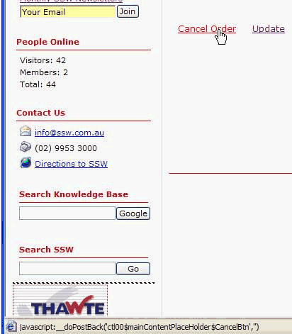

If we want to refresh and data bind the same page from client side, we can use the javascript function calls "\_\_doPostBack". We shouldn't fire this post back in LinkButton. Otherwise, there will be an error.

<!--endintro-->

  

  


``` aspnet
<asp:Panel runat="server" ID="mUpdatePanel" OnLoad="mUpdatePanel_Load">
 <asp:Label runat="server" ID="lblTime" />
 <br />
 <asp:GridView ID="gvList" runat="server" AutoGenerateColumns="false">
 <Columns>
 <asp:BoundField DataField="ID" HeaderText="ID" />
 </Columns>
 <Columns>
 <asp:BoundField DataField="Name" HeaderText="Name" />
 </Columns>
 </asp:GridView>
 <br />
 ID:<asp:TextBox ID="txtID" runat="server"/>
 Name:<asp:TextBox ID="txtName" runat="server"/>
</asp:Panel>
C#:
protected void mUpdatePanel_Load(object sender, EventArgs e)
{
 lblTime.Text = DateTime.Now.ToLongTimeString();
 ArrayList mList = (ArrayList)ViewState["List"];
 if (txtName.Text.Length > 0)
 {
 Client mClient = new Client();
 mClient.ID = Int32.Parse(txtID.Text);
 mClient.Name = txtName.Text;
 mList.Add(mClient);
 ViewState["List"] = mList;
 gvList.DataSource = mList;
 gvList.DataBind();
 }
}
```

**Sample Code** 

``` html
<a href="javascript:__doPostBack('mUpdatePanel','');">Refresh</a>
```
::: bad
Bad code  
:::

``` html
<input type="button" onclick="javascript:__doPostBack('mUpdatePanel','');" value="Refresh" />
```
::: good
Good code  
:::

We have a program called [SSW Code Auditor](https://www.ssw.com.au/ssw/CodeAuditor/) to check for this rule.
