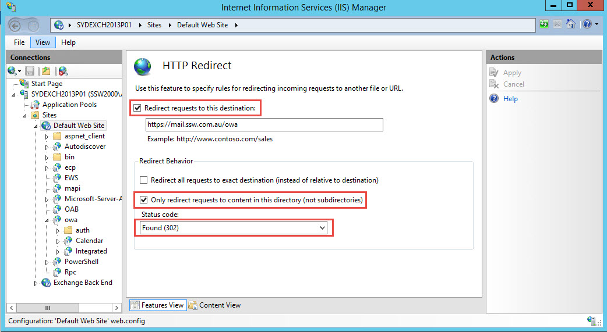
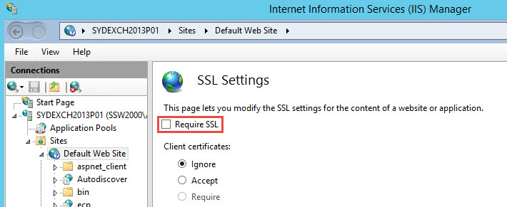
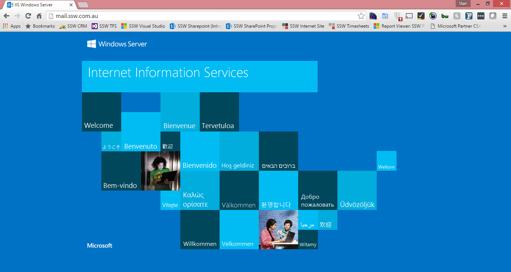
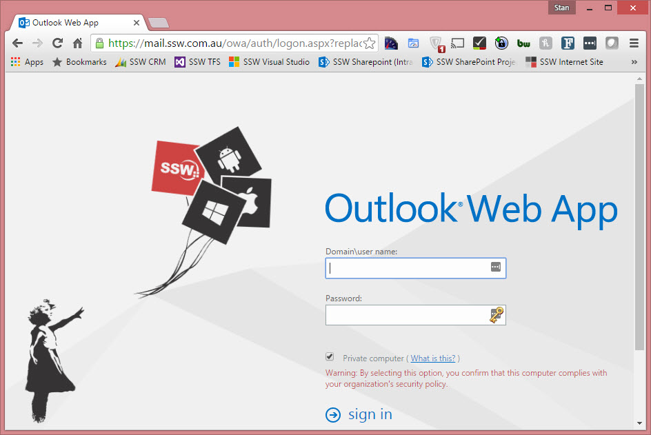

Do you configure redirection from HTTP to https for Outlook Web App (OWA)? To simplify OWA access for your users, you want to configure the Outlook Web App page to automatically redirect users to https. The HTTP redirect procedure in IIS Manager simplifies OWA URL and forces to SSL connection from  **mail&#46;domain&#46;com** to **mail&#46;domain&#46;com/owa** .

<!--endintro-->

### Step 1: Use IIS Manager to simplify OWA URL and force redirection to SSL

1. Start IIS Manager.
2. Expand the local computer, expand  **Sites**, and then click **Default website**
3. At the bottom of the Default website Home pane, click **Features View** if this option isn't already selected
4. In the **IIS** section, double-click **HTTP Redirect**
5. Select the  **Redirect requests to this destination** check box
6. Type the absolute path of the /owa virtual directory. For example, type **mail&#46;domain&#46;com/owa**
7. Under  **Redirect Behavior** , select the **Only redirect requests to content in this directory (not subdirectories)** check box
8. In the  **Status code** list, click **Found (302)**
9. In the Actions pane, click **Apply**
    

10. Click  **Default website**
11. In the Default website Home pane, double-click **SSL Settings**
12. In  **SSL Settings**, clear **Require SSL**
    

### Step 2: Remove redirection from virtual directories

1. Open a Command Prompt window.
2. Navigate to:

``` bash
<window directory="">\System32\Inetsrv.
```

3. Run the following commands:

``` bash
appcmd set config "Default Web Site/autodiscover" /section:httpredirect /enabled:false -commit:apphost 
appcmd set config "Default Web Site/ecp" /section:httpredirect /enabled:false -commit:apphost
appcmd set config "Default Web Site/ews" /section:httpredirect /enabled:false -commit:apphost
appcmd set config "Default Web Site/owa" /section:httpredirect /enabled:false -commit:apphost
appcmd set config "Default Web Site/oab" /section:httpredirect /enabled:false -commit:apphost
appcmd set config "Default Web Site/powershell" /section:httpredirect /enabled:false -commit:apphost
appcmd set config "Default Web Site/rpc" /section:httpredirect /enabled:false -commit:apphost
appcmd set config "Default Web Site/rpcwithcert" /section:httpredirect /enabled:false -commit:apphost
appcmd set config "Default Web Site/Microsoft-Server-ActiveSync" /section:httpredirect /enabled:false -commit:apphost
```

4. Finish by running the command:

``` bash
iisreset/noforce.
```

### Step 3: Test that HTTP to HTTPS redirect is working

1. Open Internet Explorer and type in **mail&#46;domain&#46;com**
2. Done - You are then redirected to **mail&#46;domain&#46;com/owa**

::: bad  
  
:::

::: good  
  
:::
