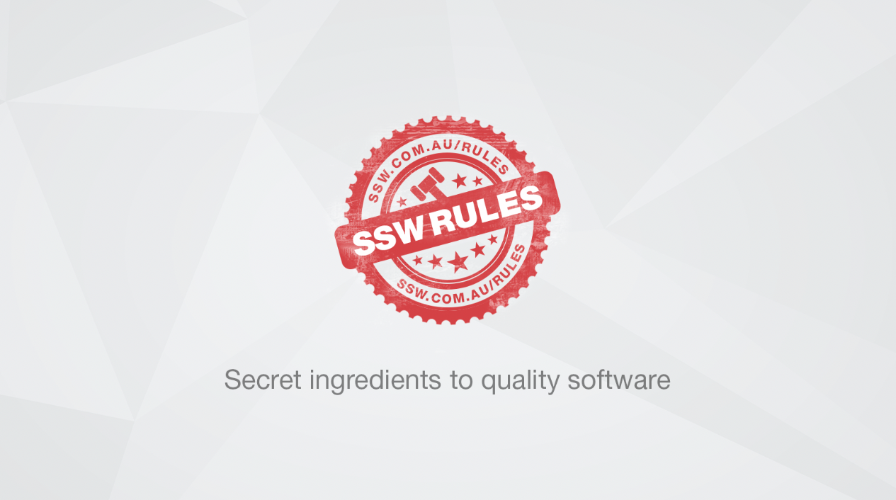

For most SSW websites and products, we use Red for the important word to create emphasis. 

<!--endintro-->

Make parts of the text different colors just like you’d highlight or boldface parts of a sentence. The duo colored text will help emphasize your message. Whenever possible use the brand colors when you do this, for SSW which is the Red: #CC4141 | RGB (204,65,65). 

::: good  

:::

::: good  

:::

::: good

:::