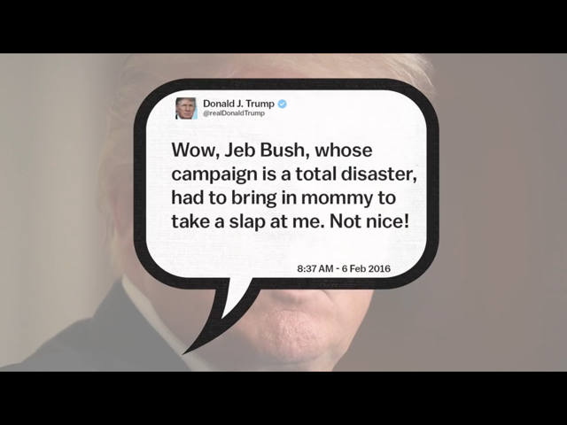

A lot of your audience will not always be looking at your video. A sweet sound to make you look at the video is a great idea.

<!--endintro-->
<dl class="goodImage">&lt;dt&gt; 
      &lt;/dt&gt;<dd>Good example: Text on the screen without audio 
       E.g. Video on YouTube: Cory Booker: Why Trump should try being nice on Twitter <a href="http://youtu.be/8p5n0TbRFEk">http://youtu.be/8p5n0TbRFEk</a> (at 1:05 you will hear the sound) </dd>  </dl>
