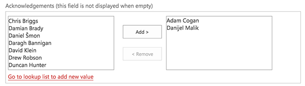
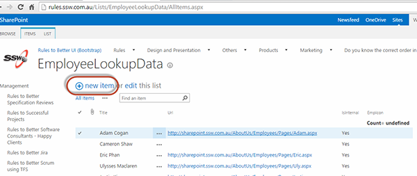

Every rule must have a person (or more) responsible for its content - The rule owner. Readers can see this person on the "Acknowledgement" section.

<!--endintro-->

### How to add the rule owner

When editing a rule, choose who is the rule owner on the "Acknowledgements" field. It is OK to have more than one person there.

  

