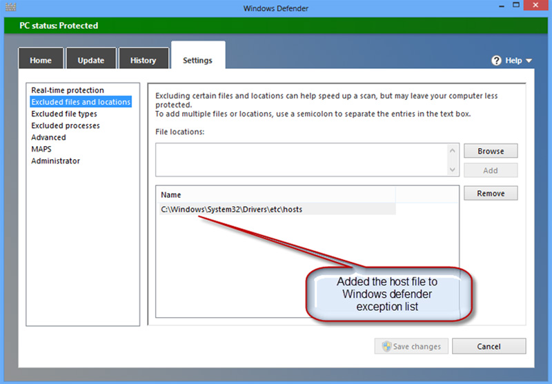

If you sometimes add entries into your Hosts file (C:\Windows\System32\Drivers\etc\Hosts) you will need to add an exception in Windows Defender as it assumes that malicious code has added an erroneous entry.

Malware will in fact often create such erroneous entries in the HOSTS file in order to divert users to alternative servers when they attempt to access sites such as facebook.com. These servers may play host to phishing sites that send user data entered on them to internet fraudsters. The removal of entries for ad servers, which many users utilise as a simple but effective ad blocker, may be down to the fact that malware also makes use of the HOSTS file to divert queries from legitimate advertising servers to their own servers. This enables fraudsters to display their own malicious ads on third-party websites.

<!--endintro-->

The relevant setting can be found under "Settings, Excluded files and locations". Of course this also mean that the anti-virus program will no longer detect any malicious modifications to the HOSTS file.

