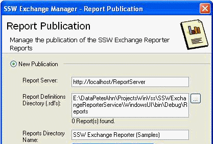
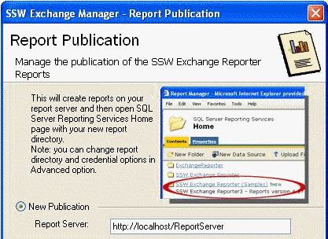

A brief introduction will give some idea about what will happen on this  process and it may save user's time and effort. So, if you expect that  not all users will be totally clear on what the settings do, add an  introduction with a screen.

<!--endintro-->

* Add screen shot with red circle at the top of the screen
* Put a description next to it

<dl class="badImage">&lt;dt&gt; 
      
   &lt;/dt&gt;<dd>Figure: Bad Example - This screen has no product introduction... The user is thinking ‘What is this going to do?’</dd></dl><dl class="goodImage">&lt;dt&gt; 
      
   &lt;/dt&gt;<dd>Figure: Good Example - This screen has product information before the settings... With a screen capture of where it ends up</dd></dl>
