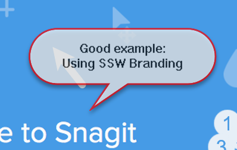

You can communicate better by using screenshots with balloons and other visual ​elements (arrows, shapes, and highlights) instead of only text. 
   <a href="/Pages/HowToUseBalloons.aspx">Read the benefits of using screenshots here</a>.
​We recommend you define a standard style for your visual elements by changing the default colors and shapes according to your branding.​ 
 <excerpt class='endintro'></excerpt> 
<h3 class="ssw15-rteElement-H3">More Information on SSW Branding </h3><dl class="badImage"><dt> 
       
   </dt><dd>Figure: Bad example - shapes being used and branding not followed </dd></dl><dl class="goodImage"><dt> 
       
        
   </dt><dd>Figure: Good example - using balloons and arrows instead and brand colours used </dd></dl>

​
To use SSW branding on your next screenshots, you should have the latest version of Snagit (which is the leading screen capture utility) and import the theme. Find SSW Snagit theme here: <a href="file:///fileserver/DataSSW/DataSSWEmployees/Templates/SSW.snagtheme">\\fileserver\DataSSW\DataSSWEmployees\Templates\SSW.snagtheme</a>.
<dl class="image"><dt>
      
   </dt><dd>Figure: SSW theme already includes all tools you need with our branding </dd></dl>
Instructions to create and use Snagit themes can be found at 
   <a href="https://www.techsmith.com/tutorial-snagit-13-quick-style-themes.html?utm_source=product&utm_medium=snagit&utm_campaign=sw13">Quick Style Themes Tutorial</a>.​ 

 
   <b>Tip #1:</b> You can automatically have your SSW Snagit presets on sign​-in via a script. See <a href="https://github.com/SSWConsulting/LoginScript">https://github.com/SSWConsulting/LoginScript</a>. <b>Tip #2: </b>Save your images in PNG instead of JPG for better quality.​ 

 
     

