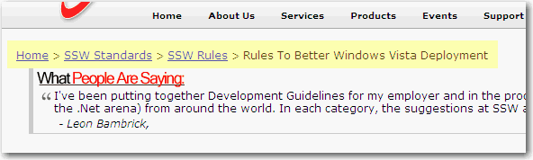

Keep a breadcrumb on every page is necessary. With this navigation tool,  users can easily location themselves and find the targets quickly. But  don't link yourself!

<!--endintro-->
<dl class="image">&lt;dt&gt; 
      
   &lt;/dt&gt;<dd>Figure: The breadcrumb</dd></dl>
So every page should have a SiteMapPath Control.
<dl class="code">&lt;dt&gt; 
      <> ID="SiteMapPath1" runat="server" SiteMapProvider="SiteMapProvider1"/> &lt;/dt&gt;<dd>Figure: SiteMapPath Control (Note: 
      <a href="http://www.ssw.com.au/ssw/redirect/ssw/CodeAuditor.htm">Code Auditor</a> checks for the yellow highlighted text)</dd></dl>
