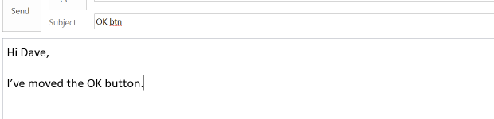
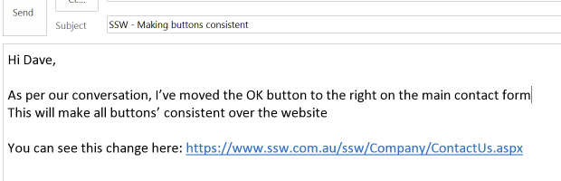

When sending an email it is very important to have context and reasoning, and make yourself as clear as possible. This way anyone can understand what was done at any time in the future. Never assume that others will understand anyways. Make sure there are always enough details in the thread/your response for anyone else to acknowledge what is going on. 

<!--endintro-->

A nice way to provide extra clear information is by [adding screenshots with useful captions](/add-useful-and-concise-figure-captions).

::: bad  
  
:::

::: good  
  
:::

**VIDEO** - [Top 10+ Rules to Better Email Communication with Ulysses Maclaren](https://www.youtube.com/watch?v=LAqRokqq4jI)
