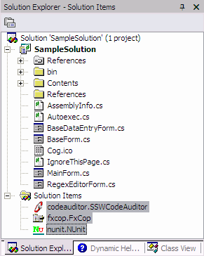
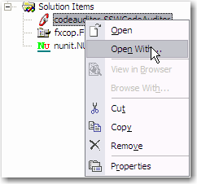

[SSW Code Auditor](http://www.ssw.com.au/ssw/CodeAuditor/Default.aspx), [NUnit](http://www.ssw.com.au/ssw/Standards/DeveloperGeneral/netTools.aspx#NUnit) and [Microsoft FxCop](http://www.ssw.com.au/ssw/Standards/DeveloperGeneral/netTools.aspx#FxCop) are tools to keep your code "healthy". That is why they should be easily accessible in every solution so that they can be run with a double click of a mouse button. 
<!--endintro-->

::: good  
  
:::

To add a [SSW Code Auditor](http://www.ssw.com.au/ssw/CodeAuditor/Default.aspx) file to your solution:

1. Start up SSW Code Auditor
2. Add a  **new Job**
3. Add a the solution file to be scanned
4. Select the rules to be run
5. Configure email (not required)
6. Select  **File &gt; Save As** (into the solution's folder as "c **odeauditor.SSWCodeAuditor** ")
7. Open your Solution in Visual Studio
8. Right click and  **add existing file**
9. Select the  **SSW Code Auditor project file**
10. Right click the newly added file and select " **Open With** "
 

::: good  
  
:::
 
11. Point it to the SSW Code Auditor executable

See [Do you run SSW Code Auditor?](/do-you-add-ssw-code-auditor-nunit-and-microsoft-fxcop-project-files-to-your-solution) 
See [Do you check your code by Code Auditor before check-in?](/do-you-add-ssw-code-auditor-nunit-and-microsoft-fxcop-project-files-to-your-solution) 
To add a [Microsoft Fx](http://www.ssw.com.au/ssw/Standards/DeveloperGeneral/netTools.aspx#FxCop)Copfile to your solution:
1. Stat up  **Microsoft FxC**
2. **op**
3. Create a  **New Project**
4. Right click the project and  **Add Target**
5. Select the Assembly (DLL/EXE) for the project
6. Select  **File &gt; Save Project As** (into the solution's folder as " **fxc** **op.FxCop** ")
7. Open your Solution in Visual Studio
8. Right click and  **add existing file**
9. Select the  **Microsoft FxCop project file**
10. **Right click** the newly added file and select " **Open With** "
11. Point it to the Microsoft FxCop executable

To add a [NUn](http://www.ssw.com.au/ssw/Standards/DeveloperGeneral/netTools.aspx#NUnit)itfile to your solution:
1. Stat up  **NUn**
2. **it**
3. Create a New Project by selecting  **File &gt; New Project** and save it to your solution directory as " **nun** **it.NUnit** "
4. From the  **Project** menu select  **Add Assembly**
5. Select the Assembly (DLL/EXE) for the project that contains unit tests
6. Select  **File &gt; Save Project**
7. Open your Solution in Visual Studio
8. Right click and  **add existing file**
9. Select the  **NUnit project file**
10. **Right click** the newly added file and select " **Open With** "
11. Point it to the NUnit executable

Now you can simply double click these project files to run the corresponding applications.

| We have a program called [SSW Code Auditor](http://www.ssw.com.au/ssw/CodeAuditor/Default.aspx) that implements this rule. |
| --- |
