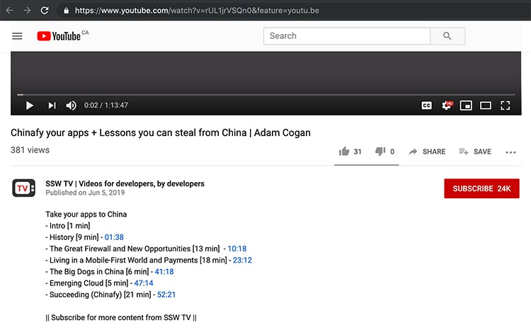

**Timestamps** are simple captions added to the description of a video. You can add the timestamps  for each section (or chapter) in a video. This is especially useful in training sessions, presentations, or any long length video. The user can even use the YouTube slider at the bottom to easily navigate through these video sections.

 **Note:** You can go extra and add  **Chapter Markers** (table of contents) on the video screen. This is done in video editing tools.

<!--endintro-->

Steps to do this:

1. Go to YouTube in your browser
2. Play the video through the timeline until you reach the moment you want a link to
3. Make a note of the time
4. Type in the timestamp (E.g. 04:41) on the video description. This also works on comments
5. Save and YouTube will automatically add a link to that exact time of the video

<dl class="goodImage">&lt;dt&gt;
      
   &lt;/dt&gt;<dd>Figure: Timestamps are interactive - Users can easily go to each section of the video by clicking on these links or using the slider</dd></dl><dl class="goodImage">   &lt;dt&gt;
       
   &lt;/dt&gt;<dd>Figure: Chapter Markers are rendered over the video and not interactive - A visual table of content inside the video screen - If you watch from 
      <a href="https://youtu.be/GNdFj-abNNo?t=158">2:38</a> you will see a new section highlighted with a dip to black, <a href="/_layouts/15/FIXUPREDIRECT.ASPX?WebId=3dfc0e07-e23a-4cbb-aac2-e778b71166a2&TermSetId=07da3ddf-0924-4cd2-a6d4-a4809ae20160&TermId=e9fe9bb3-a078-413b-8527-8dcc508637d9">subtle sound effect</a>, and strikethrough on the section that just finished </dd></dl>
