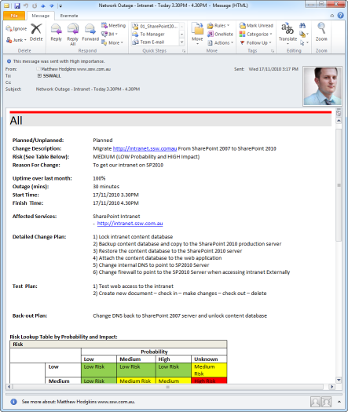

Email the staff members advising a migration is about to take place and they will not be able to check in or edit documents, and should expect errors if they do so.

**Figure - Send your staff an email warning of the outage** [Do you know how to send a good network outage email?](/rules-to-better-internet-and-networks/)

<!--endintro-->
