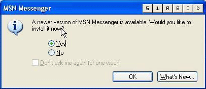
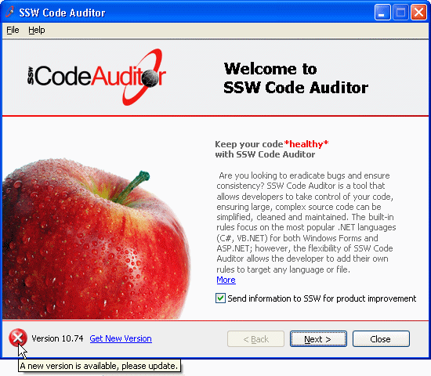
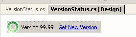
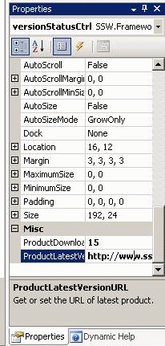
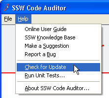

It is important to give users the ability to check for a new version of the application they are using. And once located it should be easily downloaded and installed. You need:

1. A visual identifier such as a tick or a cross on the main menu
2. A "Check for Updates" option in our Help menu.

<!--endintro-->

Remember:

* This is mainly for Windows Forms, but you can do the same for new versions of Web Applications - e.g. a knowledge base package or Reporting Services Application.
* You can do a complete check of your PC at the click of a button using [SSW Diagnostics](http://www.ssw.com.au/ssw/Diagnostics/Default.aspx).
* Since this check occurs over the web, you should use [threading](http://www.ssw.com.au/ssw/Standards/Rules/RulesToBetterWindowsForms.aspx#GuiThreading) to avoid slowing down the forms responsiveness. This is a generic component that is available in the [SSW .NET Toolkit](http://www.ssw.com.au/ssw/NETToolkit/Default.aspx).
* If the UI is a Windows Service, be aware that they don't open up the UI very often. Therefore you can't rely on this method. In a coming release Diagnostics will ask for your email and let you know when updates are available for you PC.

::: bad
 
:::

::: good
  
:::

::: good
  
:::

To keep the consistent look and consistent code, we have implemented our version checker as a user control.

As it is a user control, we can easily implement this in all our applications. We just need to place the user control on the winform, and have the ProductDownloadID and ProductLatestVersionURL entered with the correct values.

 

::: good

:::
