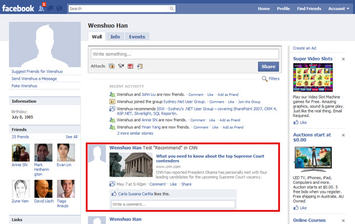
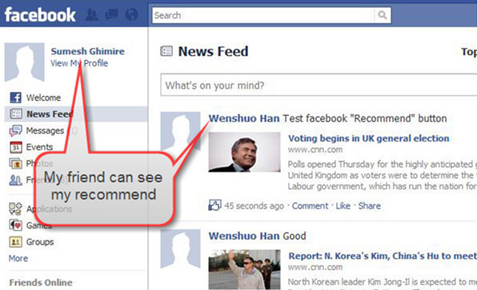

Facebook recommendations are a great way to publicize your pages without blatant advertising. 
 <excerpt class='endintro'></excerpt> 
  Figure: A user clicks recommend.    Figure: His friends can see this activity on the homepage (provided that the plugin is installed.)    Figure: It appears on your Facebook page.   Figure: Your friends also see it on your Facebook page. 

