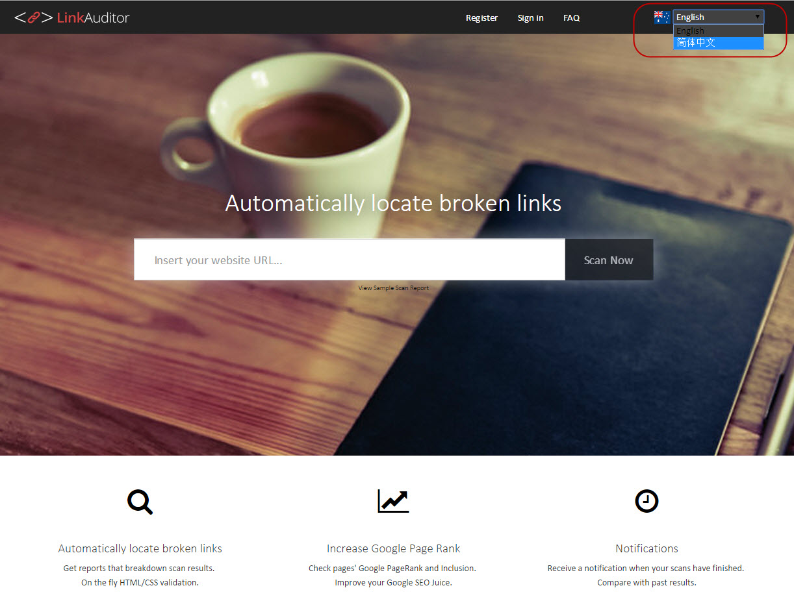

Localization because absolutely needed when  your application has to be shown to people in many countries. To make your application more friendly, it's very important to always give the user a option to change the locale (e.g. by adding locale dropdown menu on page) and remember this choice for the future visits. e.g. To change the language for your application, you can simply choose the new language from the language dropdown.

 <excerpt class='endintro'></excerpt> 
       <dd>Figure: Give the user an option to change the locale. ​</dd>

