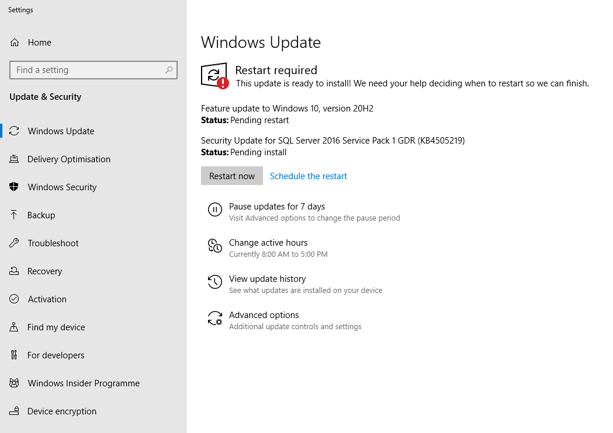

When you fix someone else's PC (locally or remotely), one of the best practices is always make sure it has the latest updates.  

<!--endintro-->

* To achieve this, we run Windows Update and install all latest updates.

::: bad
 
:::

::: good

:::

Warning: Of course if you are fixing a bug on someone’s PC, you should only update one piece of software at a time, so you know if an update fixes the problem. After that (if the company allows it), update all software to the latest version. If they get a new problem, then rollback.