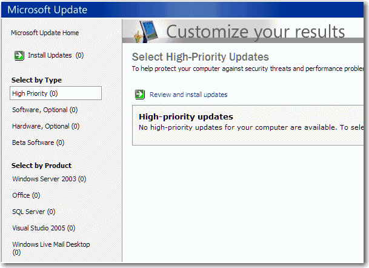
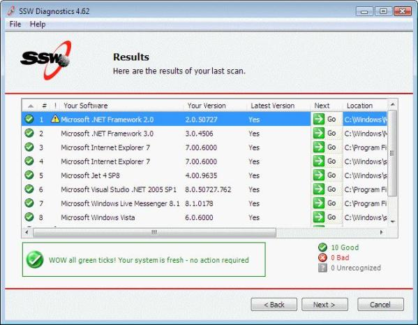

​When you fix someone else's PC (locally or remotely), one of the best practices is always make sure it has the latest updates. 
 
 <excerpt class='endintro'></excerpt> 

  
To achieve this, we run <a shape="rect" href="http://www.ssw.com.au/ssw/Redirect/MicrosoftUpdate.htm">Microsoft Updates</a> (<strong>not</strong> to confuse with Windows Updates) and install all latest updates for all the known Microsoft products.

Note: "Windows Update" only updates the operating system, where "Microsoft Update" updates other products as well, such as Microsoft Office, SQL Server, etc.

 Figure: Microsoft Update (Good - all updates are installed)

And then we run <a shape="rect" href="http://www.ssw.com.au/ssw/Diagnostics">SSW Diagnostics</a> to check the latest version of other applications (mostly non-Microsoft) are installed.

Warning: Of course if you are fixing a bug on someone’s PC, you should only update one piece of software at a time, so you know if an update fixes the problem. After that (if the company allows it), update all software to the latest version. If they get a new problem, then rollback.

  Figure: SSW Diagnostics (Good - all updates are installed) 

