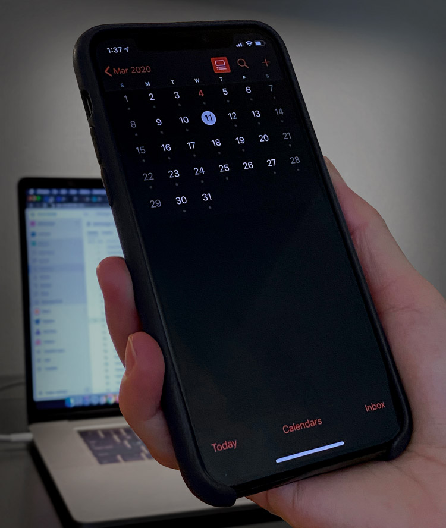

A common mistake for developers is to say "See you later, call me sometime next month".  

On your last day of consulting with a client, you should always book on the next date. Be aware of the main blockage people get, which the client is saying "How about I check my calendar and get back to you?". And often this never happens.

A better approach is to reduce the risk by:

<!--endintro-->

* Saying that you are only penciling it in and it can be canceled, and
* Bringing some urgency (by saying your calendar fills up quick)

So try something like "My calendar fills up really quick, how about I pencil you in... How about we say 2 weeks' time? Don't forget you can cancel it anytime."

::: good  
  
:::

::: greybox
**Note:** If, at the end of the day, work hasn't been fully tested or is incomplete and you haven't been booked in for the next day, tell the Product Owner (PO) that issues may arise and further work is likely to be required. After the conversation, email the PO and Cc your manager to confirm that further work is required.

E.g. "As per our conversation, this work has not yet been tested and may still include bugs. At this stage, you would prefer if we did not continue to work tomorrow, but I do recommend that we come in and finish soon."
:::
