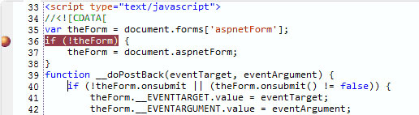

ASP.NET injects many lines during page rendering, so if you are using inline JavaScript, the line numbers will change during client side JavaScript debugging in VS.NET, FireBug or IE8 developer Tools.

<!--endintro-->
<dl class="badImage">&lt;dt&gt;&lt;/dt&gt;<dd>Figure: Bad Code - Using Inline JavaScript</dd></dl><dl class="badImage">&lt;dt&gt;&lt;/dt&gt;<dd>Figure: Bad Code - On PostBack Line numbers are changed for Inline JavaScript</dd></dl><dl class="goodImage">&lt;dt&gt;&lt;/dt&gt;<dd>Figure: Good Code - Using JavaScript on Separate file  </dd></dl>
So you should always put JavaScript in a separate file.  Then the line numbers will stay consistent during debugging. 
Keeping JavaScript in a separate file is also good for production as it improves performance due to browser caching. 

 **Note:** During development, remember to hit CTRL-F5 to force the browser to re-fetch the files from the server or you may be debugging old version of the JavaScript file.
